# ADP — Screen Reference

Live captures of the deployed application (not mockups) — eleven screens
spanning all five domains plus cross-cutting surfaces, taken from a real running
instance against real seeded data.

> **Keeping this current**: when a screen's layout changes meaningfully, re-capture
> just that PNG (`docs/research-screenshots/`) and update its caption below — no
> need to touch the others. See "Recapturing" at the bottom for the exact steps.

---

## 01 · Overview — `Overview`
*Layer: Landing*

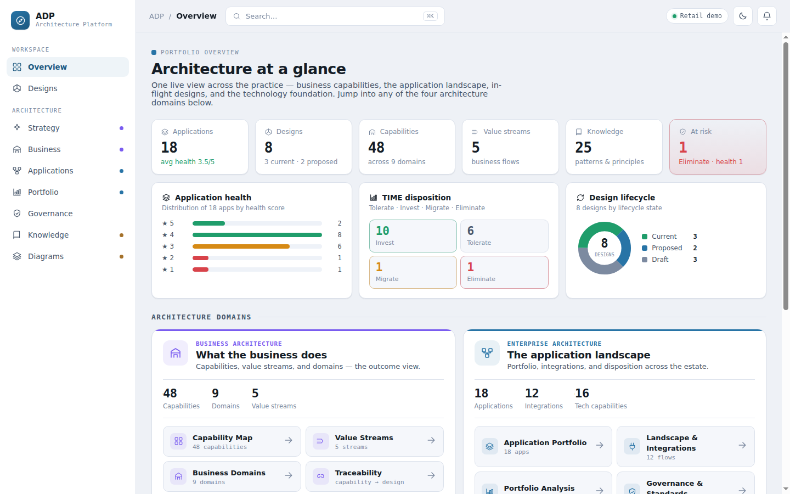

The portfolio dashboard — six live stat tiles (Applications, Designs,
Capabilities, Value streams, Knowledge, At-risk) above four "Architecture
domain" cards (Business / Enterprise / Solution / Technical), each with its own
mini-stats and deep-link buttons. The Strategy layer has no card here yet
(follow-on bead filed).

## 02 · Business Architecture — `Business → Capabilities`
*Layer 1*

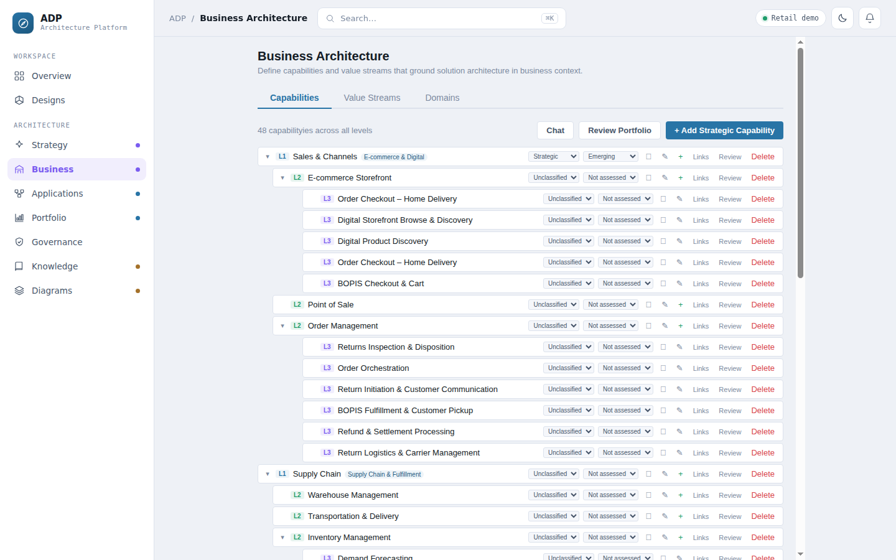

Tabbed screen: Capabilities / Value Streams / Domains. Capability Map tab shown
— the hierarchical capability tree with strategic-relevance and maturity
badges.

## 03 · Strategy — `Strategy → Objectives`
*Layer 0*

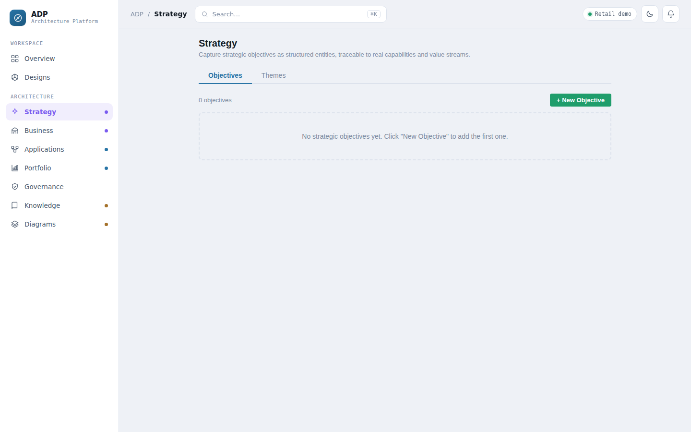

The strategy-capture screen shipped 2026-08. Objectives / Themes tabs;
empty-state shown after a test objective was deleted — "+ New Objective" opens
the structured entry form (theme, owner, statement, typed metric group, fiscal
horizon).

## 04 · Application Registry — `Applications`
*Layer 2*

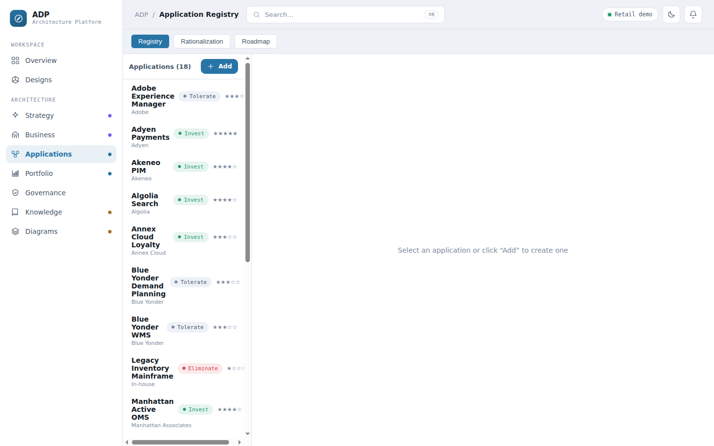

The application portfolio list — identity, ownership, and disposition fields
across the full registry, feeding TIME/7R portfolio analysis and the
sensitivity-gated risk/cost/governance views.

## 05 · Portfolio Analysis — `Portfolio`
*Layer 2*

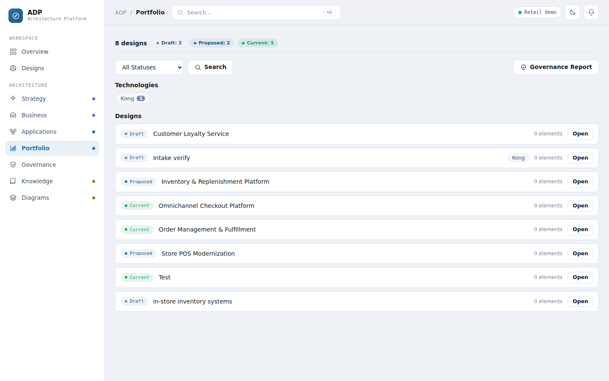

TIME disposition (Tolerate / Invest / Migrate / Eliminate) and 7R
rationalization scoring across the application estate — the portfolio-decision
view enterprise architects use for investment planning.

## 06 · Governance & Standards — `Governance`
*Cross-cutting*

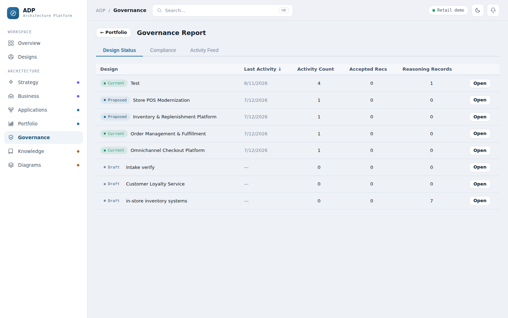

Governance reporting surface — audit trail, standards compliance, and the "at
risk" rollup that also feeds the Overview dashboard's stat tile.

## 07 · Knowledge Base — `Knowledge`
*Layer 4*

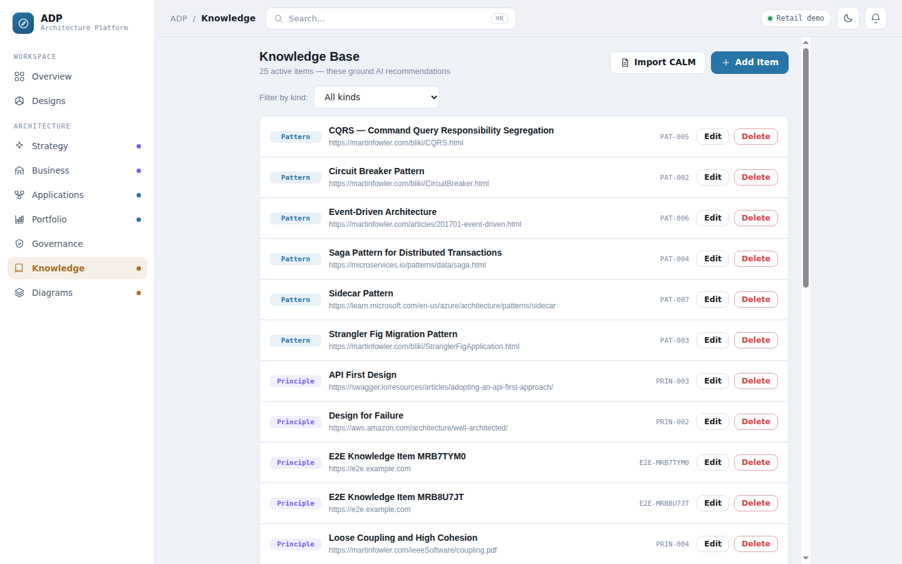

The governed knowledge base of architecture patterns and principles — hybrid
keyword + vector search over 25 items in this demo dataset.

## 08 · Diagrams — `Diagrams`
*Cross-cutting*

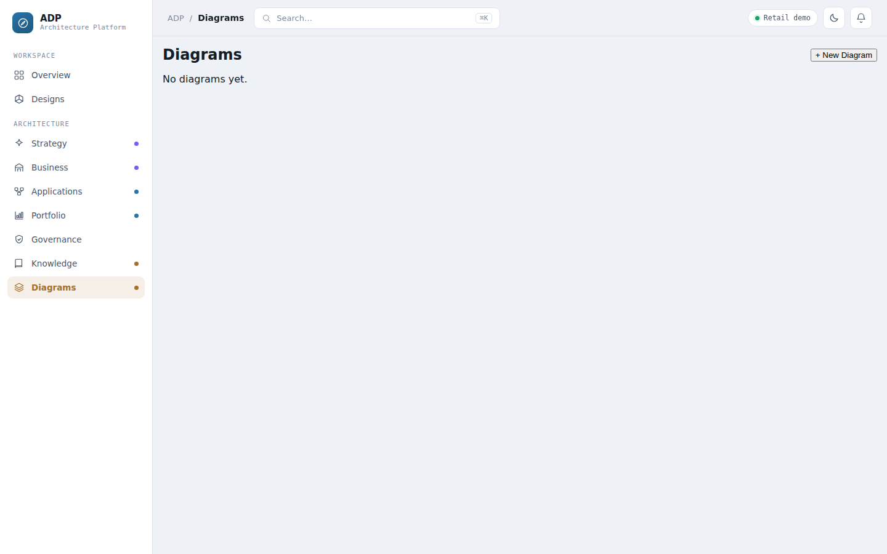

The general-purpose diagramming subsystem — flowchart, sequence, ER, UML, and
cloud-architecture types, independent of the C4 solution-design workspace.
Supports AI-assisted generation and editing via the chat assistant.

## 09 · Designs — `Designs`
*Layer 3*

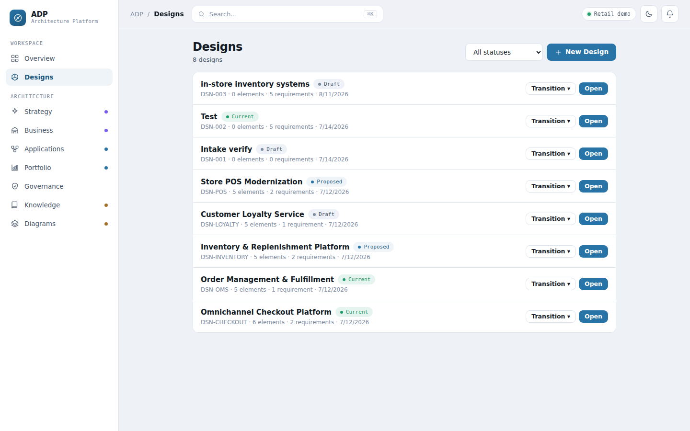

The full C4 design registry — 8 designs across every lifecycle state (draft,
proposed, current), each showing element/requirement counts and a
status-transition control.

## 10 · Requirements Intake — `Designs → Intake`
*Layer 3*

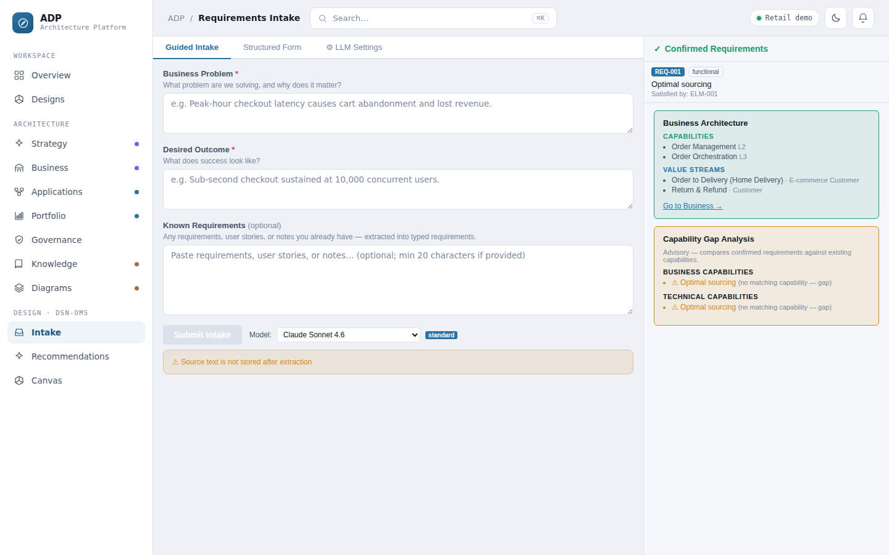

AI-assisted requirements intake open on a real design (Order Management &
Fulfillment). A business problem and desired outcome are extracted into typed,
confirmable requirements — shown here linked to real capabilities/value
streams, with an explicit capability-gap analysis and a visible "source text is
not stored" notice.

## 11 · C4 Design Canvas — `Designs → Canvas`
*Layer 3*

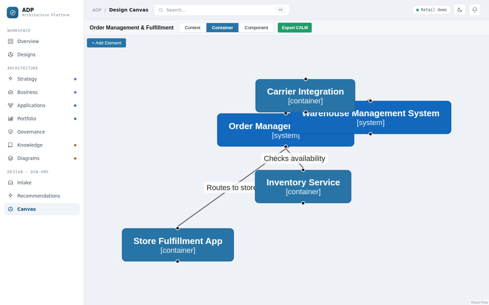

The C4 solution-design workspace (Context / Container / Component) — the
platform's original core, where AI-recommended options and LLM-as-judge reviews
ultimately land as canonical model elements.

---

## Recapturing a screen

1. Start the local stack (`uvicorn adp.api.app:app --port 8001`, `cd web && npm run dev`), auth disabled for local dev.
2. Navigate to the screen in a 1440×900 browser viewport.
3. Screenshot the viewport (not full-page — keep aspect ratio consistent across the set) and save as `docs/research-screenshots/<NN>-<name>.png`, overwriting the existing file.
4. Update this file's caption if the screen's structure changed meaningfully; leave it as-is for pure content/data changes.

---

*Companion documents: [`research-business-requirements.md`](research-business-requirements.md), [`research-solution-architecture.md`](research-solution-architecture.md).*
