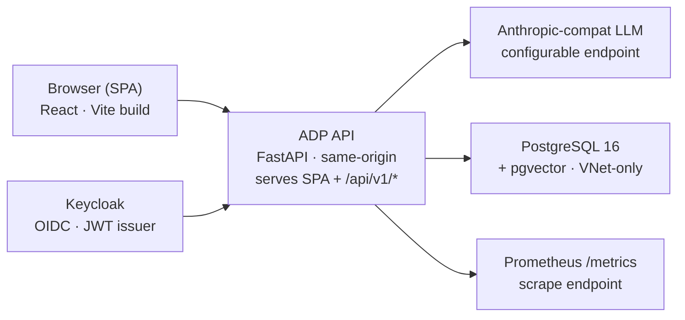

# ADP — Solution Architecture Summary

How the platform is actually built: package structure, data model, security
model, AI orchestration, and deployment topology — drawn directly from the
running codebase, not an aspirational diagram.

> **Note on scope**: this is a concise, research-handoff summary, distinct from
> [`solution-architecture.md`](solution-architecture.md), ADP's own detailed,
> tool-maintained canonical architecture document (machine-readable front
> matter, generated C4 views, full router inventory). Read that one for
> implementation-level detail; read this one for fast, accurate orientation.

**Snapshot**: 25 migrations applied · 26 backend packages under `src/adp/` ·
1185 backend tests · 192 frontend tests.

## Contents

1. [Technology stack](#1-technology-stack)
2. [System topology](#2-system-topology)
3. [Backend package architecture](#3-backend-package-architecture)
4. [Recurring architectural conventions](#4-recurring-architectural-conventions)
5. [Security & access control](#5-security--access-control)
6. [AI orchestration model](#6-ai-orchestration-model)
7. [Data model shape](#7-data-model-shape)
8. [Deployment & CI/CD](#8-deployment--cicd)
9. [Quality gates](#9-quality-gates)
10. [Considerations for external research](#10-considerations-for-external-research)

---

## 1. Technology stack

| Layer | Choice |
|---|---|
| Backend runtime | Python 3.12, FastAPI |
| ORM | SQLAlchemy 2.x async (Core-style table definitions) |
| Database | PostgreSQL 16 + pgvector |
| Migrations | Alembic, 25 sequential revisions |
| Validation | Pydantic v2, `extra="forbid"` on every boundary model |
| Identity | Keycloak (OIDC/JWT), python-jose |
| Frontend | TypeScript 5, React 18, Vite 5 |
| Client state | TanStack Query v5 |
| C4 canvas | React Flow v12 (`@xyflow/react`), Zustand v4 |
| Diagram layout | `@dagrejs/dagre` (auto-layout) |
| Rendering | cairosvg (SVG→PNG, no JVM dependency) |
| Telemetry | prometheus-client, OpenTelemetry-style span helpers |
| E2E tests | Playwright |
| LLM client | httpx against a configurable Anthropic-compatible endpoint |

## 2. System topology

One FastAPI service, one Postgres database, a static SPA served alongside it,
Keycloak for identity. Deliberately not a microservices decomposition — the
value is a connected graph, and splitting it into services early would recreate
the exact cross-tool traceability gap the product exists to close.

Same-origin service — no CORS surface, no ambient session cookie (Bearer token
auth only).

## 3. Backend package architecture

One top-level Python package per bounded domain, each with the same three-file
shape: `models.py` (Pydantic boundary types), `store.py` (async SQLAlchemy CRUD),
`router.py` (FastAPI endpoints). 26 packages under `src/adp/`.

| Package | Owns |
|---|---|
| `strategy` | Strategic themes/objectives, links to capabilities & value streams — the newest domain |
| `business` | Capabilities, value streams, domains, capability-design traceability links |
| `application` | Application registry, technical capabilities, integrations, transformation initiatives |
| `store` | The canonical `DesignStore` — Architecture Description persistence, the platform's original core |
| `intake` / `recommendation` | AI requirements extraction and design-option generation (LangGraph-orchestrated) |
| `eval` | LLM-as-judge design review (multi-critic fan-out) |
| `diagrams` | Standalone diagram types (flowchart/sequence/ER/UML/cloud-architecture) — deliberately independent of C4 |
| `chat` | The AI chat assistant — streaming, multi-turn, read-only tool access into other domains |
| `knowledge` | Pattern/principle knowledge base, hybrid keyword + vector search |
| `authz` / `auth` | RBAC permission model, Keycloak JWT validation, route-level enforcement |
| `telemetry` | Trace-id propagation, span helpers, Prometheus metrics, no-leak contract |
| `export` | Continuous JSON export of business/application data to versioned files ("architecture as code") |
| `admin` | AI prompt override management, platform-admin-gated |

> **Design decision, applied repeatedly**: a genuinely new sub-domain always gets
> its own sibling package rather than growing an already-large existing one.
> When the Strategy domain was added, `adp.business`'s three core files already
> totalled 2,847 lines — measured directly before deciding to keep
> `adp.strategy` separate, following the same precedent set by `adp.diagrams`
> and `adp.chat`.

## 4. Recurring architectural conventions

**Cross-package validation without duplication.** When one domain needs to
validate that a foreign id genuinely exists in another domain's registry — e.g.
linking a strategic objective to a capability — the router opens a *second*,
domain-scoped database session and calls that domain's own already-public store
function directly (`adp.business.store.get_capability`), rather than duplicating
the check or standing up a new internal HTTP call.

**Join tables, one consistent shape.** Every many-to-many traceability link
(capability↔design, value-stream↔design, objective↔capability,
objective↔value-stream) uses the same table shape: composite primary key,
`ON DELETE CASCADE` on both foreign-key legs, one index on the "other side," a
plain `created_at`. Store-layer table definitions deliberately omit the FK/PK
objects themselves — those live only in the Alembic migration, which is the
single source of truth for constraints; the Python `Table()` object exists
purely to build SELECT/INSERT/UPDATE/DELETE statements.

**AI proposes, human confirms.** Every AI-assisted write path shares one
operation-store pattern: an AI step produces a typed, inspectable proposal held
in a short-TTL in-process store; a human-driven confirm/reject endpoint is the
only path that ever materializes it into the canonical model. No AI step writes
directly.

**Vendoring over live cross-repo dependency.** Where ADP reuses a mature
component from a sibling project (the diagramming core library), the code is
copied in and tracked in-repo rather than pulled as a live dependency — so the
build stays reproducible from a clean checkout alone, a constitutional
requirement (Article XIV).

## 5. Security & access control

A single, versioned role→action permission table (currently **v1.8.0**) is the
sole authority for every gated write. Reads are ungated by default; a handful of
sensitivity-marked reads (application risk/cost/governance data) carry their own
dedicated permission, independent of the domain's general write permission.

Enforcement happens at the app level via a route-prefix→action mapping checked
on every mutating request — new domains register one prefix rule rather than
hand-rolling a permission check per endpoint. A completeness test asserts every
registered mutating route has a mapped action, so a forgotten gate fails CI
rather than shipping silently open.

| Layer | Mechanism |
|---|---|
| Authentication | Keycloak-issued JWT, validated via JWKS; disabled cleanly for local dev via one env var |
| Authorization | Route-prefix→`ActionType` table, checked by app-level middleware on every request |
| Data isolation | Sensitive application data (risk/cost/governance) gated by its own permission, distinct from general write access |
| Audit | Every AI operation and confirmed write recorded with actor, timestamp, and reasoning trace where applicable |
| Transport | Same-origin SPA+API, Bearer-token auth only — no CORS surface, no ambient cookie to protect against CSRF |

## 6. AI orchestration model

Three distinct AI-assisted flows, each a small LangGraph-style step graph with
inspectable intermediate state — not a single opaque agent loop.

1. **Requirements intake** — free text → typed, confirmable requirement
   proposals. Raw source text is never persisted, only the extracted structure.
2. **Recommendation engine** — confirmed requirements → typed design-option
   proposals a human accepts into the canonical model as elements/relationships.
3. **LLM-as-judge review** — a fan-out of independent critics evaluate a design
   in parallel; the verdict is stored transiently and optionally persisted as a
   design annotation on human acceptance.

A fourth surface, the **chat assistant**, is architecturally distinct from the
other three: it's the platform's only streaming endpoint (SSE), and its tool
layer is mechanically read-only — a dedicated test asserts the tool registry
contains no write-capable tool, so the chat surface can never become a fifth AI
write path by accident.

## 7. Data model shape

25 sequential Alembic migrations describe the schema. The two dominant shapes:

- **Hierarchical entities** — capabilities (3 levels), value stream stages —
  parent-referencing rows with a position column for ordering.
- **Many-to-many traceability links** — the composite-PK join-table shape
  described in §4, now used four times (capability↔design, value-stream↔design,
  objective↔capability, objective↔value-stream) and about to be used a fifth
  (objective↔design, filed as a follow-on).

Typed classification fields follow one of two shapes depending on whether the
value set is an ordered scale or a semantic set: a bounded ordered scale (e.g.
maturity level, strategic relevance) is a `SmallInteger` with a named CHECK
constraint; a semantic, unordered set (e.g. objective direction:
increase/decrease/reach) is `Text` with its own named CHECK constraint. Money
and metric-target values are always `NUMERIC`, never floating point.

## 8. Deployment & CI/CD

| Aspect | Detail |
|---|---|
| Compute | Azure Container Apps — API service + Keycloak, both internal-facing except the public API ingress |
| Database | Azure PostgreSQL Flexible Server, VNet-injected — no public network path exists |
| Registry | Azure Container Registry |
| Secrets | Azure Key Vault, RBAC-authorized; never in Bicep params or deployment history |
| CI/CD identity | GitHub Actions OIDC federated credential — no long-lived cloud secret in the pipeline |
| CI/CD scope | Deploy principal scoped to exactly ACR push + Container Apps update — no database or Key Vault access |

## 9. Quality gates

| Gate | Tool | Runs |
|---|---|---|
| Backend tests | pytest — 1185 unit + contract tests | Every change |
| Frontend tests | Vitest — 192 unit + component tests | Every change |
| Type checking | mypy (backend), tsc --noEmit (frontend) | Every change |
| Lint | ruff | Every change |
| Schema drift | `adp-generate --check` — canonical schema must match generated output | Every change |
| SAST | bandit | CI |
| Dependency CVEs | pip-audit (Python), npm audit (JS) | CI |
| IaC scan | Checkov against the Bicep templates | CI |
| DAST | OWASP ZAP against the live OpenAPI schema | CI |
| Route-permission completeness | dedicated test asserting every mutating route has a mapped action | Every change |
| E2E | Playwright — API-level + browser-level suites | On demand / CI |

## 10. Considerations for external research

- The system is deliberately a modular monolith, not microservices — is that
  still the right call once the domain count (26 packages and growing) reaches a
  scale where independent deploy cadence starts to matter, or does the
  connected-graph value proposition keep favoring one service for the
  foreseeable future?
- The AI orchestration layer runs three separate LangGraph-style step graphs
  plus one streaming chat surface, all against a configurable
  Anthropic-compatible endpoint — what would a shared orchestration abstraction
  across all four look like without weakening the mechanically-enforced
  human-confirm gate or the chat tool layer's read-only boundary?
- Vendoring a sibling project's diagramming library was chosen over a live
  dependency for build reproducibility — as the vendored surface grows, what's
  the right threshold for extracting it into a properly versioned internal
  package instead?
- pgvector handles the knowledge base's semantic search today at a small item
  count (~25 in the demo dataset) — what's the realistic ceiling before a
  dedicated vector store becomes necessary, and does the current hybrid
  keyword+vector approach hold up past it?

---

*Companion documents: [`research-business-requirements.md`](research-business-requirements.md), [`research-screen-reference.md`](research-screen-reference.md).*
