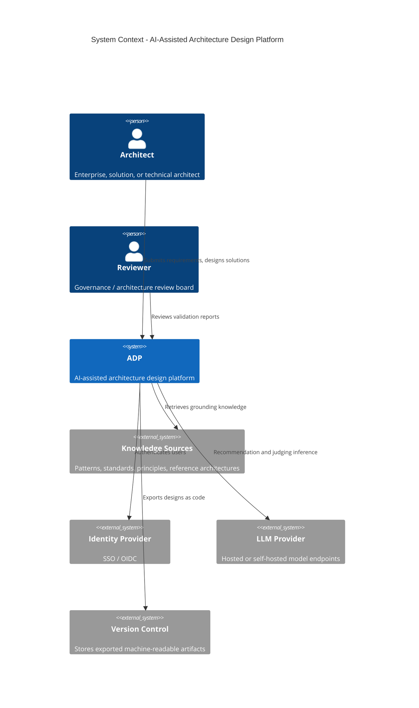
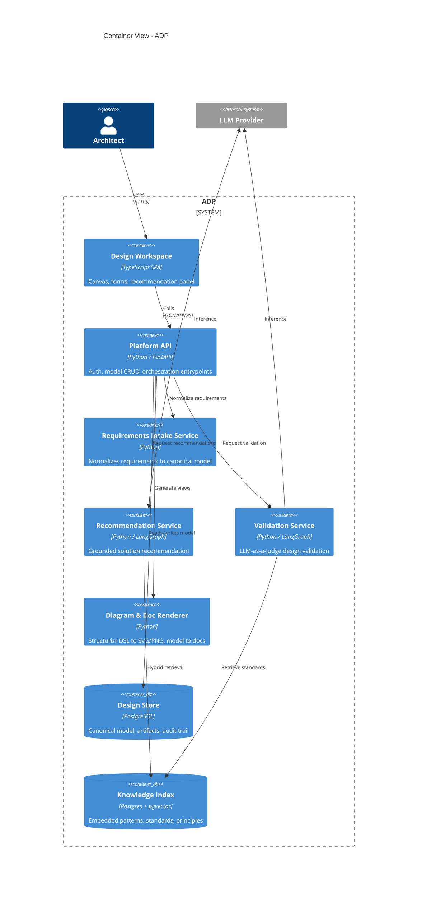

## Document Metadata

This document is the canonical, human-readable rendering of a machine-readable architecture description. The platform it describes ("ADP", a working name) is itself an instrument for producing architecture, so this document deliberately follows the same conventions ADP enforces on its own outputs: stable section headers, typed front matter, fenced code blocks with explicit languages, and tabular data rather than prose where the content is structured.

| Field | Value |
|---|---|
| Product | AI-Assisted Architecture Design Platform (ADP) |
| Document scope | High-level solution architecture |
| Audience | Enterprise, solution, and technical architects |
| Source of truth | Structured artifacts (YAML/JSON), not this prose |
| Diagram source | Diagram-as-code (Structurizr DSL), rendered to SVG/PNG |
| Status | Draft for review |

The front matter above is intended to be parsed. Every artifact ADP emits — including this document — carries equivalent typed metadata so that downstream tooling (CI gates, search indexes, lineage trackers) can consume it without scraping prose.

## Purpose and Scope

ADP is a platform that lets architects design solutions at every level of abstraction, from enterprise landscapes down to technical component designs, with AI assistance grounded in the organization's existing patterns, standards, and principles. It accepts business requirements as input, recommends candidate solutions drawn from a curated knowledge base, provides a governed C4 diagramming surface with a fixed visual language, and validates every design against enterprise standards using an LLM-as-a-Judge evaluation layer.

In scope: requirements intake and normalization, AI-driven solution recommendation, C4 visual design with locked styling, automated design validation, and the persistence of all design artifacts as machine-readable data. Out of scope for this version: build/deployment automation of the designed solutions themselves, cost management tooling, and runtime observability of deployed solutions. ADP designs solutions; it does not operate them.

The defining constraint that shapes the entire architecture is that **every artifact ADP produces is machine-readable first and human-readable second**. Prose documents and rendered diagrams are projections of an underlying typed model, never the primary record. This makes designs queryable, diffable, gate-able in CI, and consumable by other AI systems.

## Architecture Vision

The platform treats an architecture design as data, not as a document or a drawing. An architect interacts with editing surfaces (forms, a diagram canvas, a recommendation panel), but each interaction mutates a single canonical model. Human-readable documents, C4 diagrams, requirements traceability matrices, and validation reports are all generated views over that model. Because the model is typed and versioned, the same design can be rendered for an enterprise audience as a system landscape and for a technical audience as a component decomposition without divergence.

AI is woven through three distinct touchpoints rather than bolted on as a single chatbot: it normalizes incoming requirements into the canonical model, it recommends solution options grounded in retrieved organizational knowledge, and it judges finished designs against standards. Each touchpoint produces structured, cited, auditable output. No AI step is permitted to write to the canonical model without provenance and, where the change is consequential, human confirmation.

## Stakeholders and Personas

ADP serves three architect personas who work at different abstraction levels but on the same underlying model, which is what allows a single design to remain coherent across levels.

| Persona | Primary level | Works with | Cares most about |
|---|---|---|---|
| Enterprise architect | System landscape, C4 L1 (Context) | Capabilities, principles, cross-system dependencies | Alignment to strategy, standards conformance, reuse |
| Solution architect | C4 L2 (Container) | Containers, integrations, NFRs, trade-offs | Buildability, fit to requirements, option comparison |
| Technical architect | C4 L3/L4 (Component/Code) | Components, interfaces, technology choices | Correctness, detailed design, technical standards |

Secondary stakeholders include governance and review boards (who consume validation reports and traceability), and downstream delivery teams (who consume the machine-readable design as the contract for what to build).

## Architecture Principles

These principles govern ADP itself and are the seed set ADP ships with for evaluating designs built on it. They are stored as typed records (`id`, `statement`, `rationale`, `implications`) so the recommendation and validation subsystems can reference them directly.

| ID | Principle | Implication |
|---|---|---|
| ADP-PR-01 | Model is the source of truth | Documents and diagrams are generated, never hand-edited as primaries |
| ADP-PR-02 | Everything machine-readable | All outputs conform to a published schema with typed metadata |
| ADP-PR-03 | Grounded AI only | Recommendations and judgments must cite retrieved knowledge, not invent it |
| ADP-PR-04 | Provenance on every change | Each model mutation records its origin (human or AI), inputs, and rationale |
| ADP-PR-05 | Fixed visual language | Diagram styling is locked and non-overridable to guarantee consistency |
| ADP-PR-06 | Human-in-the-loop for consequence | AI proposes; a human confirms before consequential commits |
| ADP-PR-07 | Traceability end to end | Every component traces to a requirement, principle, and validation verdict |

## Solution Capabilities

The platform's capabilities map directly to the requested behaviors and to the architect personas. Each capability is owned by a subsystem described later in this document.

| Capability | Description | Owning subsystem |
|---|---|---|
| Requirements intake | Ingest business requirements and normalize to a canonical model | Requirements Intake |
| Pattern-grounded recommendation | Recommend solutions using existing patterns, standards, principles | AI Recommendation Engine |
| Multi-level C4 design | Graphical design at context, container, and component levels | C4 Visual Design |
| Consistent visual language | Fixed color and shape choices across all diagrams | C4 Visual Design |
| Automated design validation | Judge designs against standards, patterns, prior solutions | LLM-as-a-Judge |
| Machine-readable output | Persist and export all artifacts as typed, queryable data | Documentation Model |
| Traceability | Thread requirements through design to validation | Canonical Data Model |

## System Context (C4 Level 1)

At the context level, ADP sits between architects and the organizational knowledge it grounds itself in. The diagram below is illustrative; the authoritative version is generated from the diagram-as-code source held in the model.



The platform deliberately depends on external knowledge sources rather than embedding them, so that the organization's living patterns and standards remain the single canonical source and ADP indexes them.

## Container Architecture (C4 Level 2)

ADP decomposes into a small set of containers behind an API gateway. The recommendation and validation work is orchestrated as agentic workflows rather than single model calls, which keeps each AI step inspectable and individually gate-able.



The split between `intake`, `reco`, and `judge` as separate services reflects that each is an independent AI workload with its own latency profile, prompt assets, and evaluation rubric, and each can be scaled and audited on its own.

## Requirements Intake Subsystem

The intake subsystem accepts business requirements in whatever form the organization produces them — uploaded documents, structured forms, or pasted text — and normalizes them into a canonical `Requirement` model. Normalization extracts the requirement statement, classifies it (functional, non-functional, constraint, or driver), assigns a stable traceability ID, and links it to any capabilities or principles it references. Extraction is AI-assisted but every extracted requirement is presented to the architect for confirmation before it enters the model, satisfying the human-in-the-loop principle.

The normalized requirement is the anchor for traceability. Downstream, every recommended option, every component placed on a diagram, and every validation verdict can be threaded back to the requirements that justify it, which is what lets a reviewer ask "why does this component exist?" and get a machine-answerable response.

```python
from enum import Enum
from pydantic import BaseModel, Field

class RequirementKind(str, Enum):
    FUNCTIONAL = "functional"
    NON_FUNCTIONAL = "non_functional"
    CONSTRAINT = "constraint"
    DRIVER = "driver"

class Requirement(BaseModel):
    id: str = Field(..., description="Stable traceability id, e.g. REQ-014")
    statement: str
    kind: RequirementKind
    source: str = Field(..., description="Origin document or input")
    capabilities: list[str] = Field(default_factory=list)
    principles: list[str] = Field(default_factory=list)
    confirmed_by: str | None = None
```

## Knowledge Base and Pattern Repository

The recommendation and validation subsystems are only as good as the knowledge they are grounded in. ADP maintains an indexed knowledge base assembled from the organization's existing assets: architecture patterns, reference architectures, technical and security standards, architecture principles, and a corpus of prior approved solutions. Each item is stored as a typed record with its full text, structured metadata, and an embedding, enabling hybrid retrieval that combines vector similarity, keyword search, and graph relationships (for example, "patterns that satisfy principle ADP-PR-03").

Crucially, the knowledge base is indexed from the organization's canonical sources rather than being a fork of them. When a standard changes upstream, re-indexing keeps ADP's grounding current, and the provenance recorded on every recommendation and verdict points back to the specific knowledge version used.

| Knowledge type | Role in recommendation | Role in validation |
|---|---|---|
| Patterns | Building blocks for candidate options | Conformance target |
| Reference architectures | Templates to adapt | Comparison baseline |
| Standards | Constraints on options | Pass/fail criteria |
| Principles | Ranking and trade-off lens | Conformance target |
| Prior solutions | Precedent and reuse | Consistency baseline |

## AI Recommendation Engine

The recommendation engine turns confirmed requirements into ranked, justified solution options. It runs as an orchestrated workflow: it retrieves the patterns, standards, principles, and prior solutions relevant to the requirements; it generates a small set of candidate options that compose those building blocks; it performs a trade-off analysis across the options against the relevant non-functional requirements and principles; and it ranks them. Every option carries explicit provenance — which retrieved items it drew on — so an architect can see exactly why a recommendation was made and which standard or pattern backs each part of it.

The engine recommends; it never silently commits. Accepting a recommendation is an explicit architect action that materializes the chosen option as model elements (containers, components, relationships) with their provenance preserved. Because options are grounded in retrieval rather than free generation, the engine reuses existing organizational solutions by construction rather than reinventing them.

```python
class SolutionOption(BaseModel):
    id: str
    summary: str
    grounded_on: list[str] = Field(
        ..., description="IDs of patterns/standards/principles/prior solutions used"
    )
    satisfies: list[str] = Field(..., description="Requirement IDs addressed")
    tradeoffs: dict[str, str] = Field(
        default_factory=dict, description="NFR or principle -> assessment"
    )
    rank: int
```

## C4 Visual Design Subsystem

The design canvas lets architects build C4 diagrams at the context, container, and component levels, matching the three personas. The canvas is a view over the canonical model: placing an element on the container diagram creates a typed `Container` record, and drawing a relationship creates a typed `Relationship` record. This means the diagram and the underlying data can never drift, and the same model can be projected to a different C4 level without re-drawing.

Diagrams are persisted as diagram-as-code (Structurizr DSL) generated from the model, which keeps them machine-readable, diffable in version control, and re-renderable. The renderer container produces SVG and PNG outputs on demand from that DSL. Architects manipulate the model through the canvas; they do not hand-author the DSL, but the DSL is always available as an export.

```text
workspace {
  model {
    arch = person "Architect"
    adp  = softwareSystem "ADP" {
      web   = container "Design Workspace"
      api   = container "Platform API"
      store = container "Design Store"
    }
    arch -> web "Uses"
    web  -> api "Calls"
    api  -> store "Reads/writes"
  }
  views {
    container adp { include * autolayout lr }
    theme default
  }
}
```

## Fixed Diagram Color Specification

To guarantee that every diagram across the platform looks consistent regardless of who authored it, ADP enforces a single locked visual theme. Architects cannot override colors, shapes, or fonts; styling is a property of the element's type in the model, applied automatically at render time. The theme is itself a machine-readable artifact, versioned alongside the schema, so a change to the visual language is a deliberate, reviewable event rather than an ad-hoc per-diagram choice.

The palette maps C4 element types to fixed fills, strokes, and text colors chosen for sufficient contrast. Datastores are distinguished by shape (cylinder) in addition to color, so the diagrams remain legible without relying on color alone.

| Element type | Fill | Stroke | Text | Shape |
|---|---|---|---|---|
| Person / Actor | `#08427B` | `#052E56` | `#FFFFFF` | Person |
| Software System (in scope) | `#1168BD` | `#0B4884` | `#FFFFFF` | RoundedBox |
| External System | `#999999` | `#6B6B6B` | `#FFFFFF` | RoundedBox |
| Container | `#438DD5` | `#2E6295` | `#FFFFFF` | RoundedBox |
| Component | `#85BBF0` | `#5D9BD8` | `#1A1A1A` | Component |
| Datastore | `#2E7D32` | `#1B5E20` | `#FFFFFF` | Cylinder |
| Boundary | none | `#444444` | `#444444` | DashedBox |
| Relationship | n/a | `#707070` | `#444444` | Solid line |
| Async relationship | n/a | `#707070` | `#444444` | Dashed line |

This theme is published as a JSON document and is the only styling the renderer will apply. Because styling derives from element type, two architects designing unrelated solutions produce diagrams that are visually identical in language, which is the consistency the platform guarantees.

## LLM-as-a-Judge Validation Subsystem

Validation evaluates a completed or in-progress design against the organization's standards, patterns, and prior approved solutions, and produces a structured verdict an architect or review board can act on. Rather than a single model call, validation fans out into independent critics, each scoped to one dimension — for example a standards-conformance critic, a principles-alignment critic, a pattern-fit critic, and a consistency-with-prior-solutions critic. Each critic retrieves the specific standards or patterns relevant to the design, scores the design against a fixed rubric, and must cite the exact item it is judging against. An aggregation step combines the critic verdicts into an overall result and applies deterministic gating thresholds.

The judge produces machine-readable verdicts, not prose opinions. Each finding identifies the design element at fault, the standard or principle it violates, a severity, and a rationale citing the retrieved source. Gating is deterministic on top of those scores so that "pass" and "fail" are reproducible rather than at the model's discretion, and a human reviewer can override any verdict with a recorded justification. Verdicts are written to the audit trail and linked to the design version they evaluated, so the validation history of a design is itself queryable.

```python
class Severity(str, Enum):
    INFO = "info"
    MINOR = "minor"
    MAJOR = "major"
    BLOCKER = "blocker"

class Finding(BaseModel):
    element_id: str
    violated: str = Field(..., description="Standard/principle/pattern id")
    severity: Severity
    rationale: str
    citation: str = Field(..., description="Knowledge item + version used")

class Verdict(BaseModel):
    design_version: str
    score: float = Field(..., ge=0.0, le=1.0)
    passed: bool
    findings: list[Finding] = Field(default_factory=list)
    reviewer_override: str | None = None
```

## Machine-Readable Documentation Model

Every artifact ADP produces — designs, requirements matrices, recommendation records, validation reports, and the human-readable documents rendered for stakeholders — conforms to a published schema and carries typed metadata. There is no artifact whose primary form is unstructured prose. Human-readable documents like this one are generated as a projection of the model and stamped with front matter that mirrors the model's fields, so the rendered document is as parseable as the data behind it.

This is what makes ADP's output usable by other systems: a CI pipeline can gate a merge on a design's validation score, a search index can answer "which solutions use pattern P-12", and a downstream delivery team can consume the design as a contract. Export targets include the canonical JSON/YAML model, the Structurizr DSL for diagrams, rendered SVG/PNG, and generated Markdown documents, all of which are pushed to version control as the durable record.

## Canonical Data Model

The canonical model is the single source of truth that every subsystem reads from and writes to. It binds requirements, design elements, recommendations, and verdicts into one traceable graph. The top-level container is the `ArchitectureDescription`, which holds the requirements, the C4 elements and relationships, the recommendation records that justify them, and the validation history.

```python
class C4Level(str, Enum):
    CONTEXT = "context"
    CONTAINER = "container"
    COMPONENT = "component"

class Element(BaseModel):
    id: str
    name: str
    level: C4Level
    element_type: str = Field(..., description="person|system|container|component|datastore")
    satisfies: list[str] = Field(default_factory=list, description="Requirement ids")
    provenance: str | None = Field(None, description="Recommendation/option id if AI-derived")

class Relationship(BaseModel):
    id: str
    source: str
    target: str
    description: str
    technology: str | None = None
    asynchronous: bool = False

class ArchitectureDescription(BaseModel):
    id: str
    version: str
    requirements: list[Requirement]
    elements: list[Element]
    relationships: list[Relationship]
    recommendations: list[SolutionOption] = Field(default_factory=list)
    verdicts: list[Verdict] = Field(default_factory=list)
```

The `satisfies` and `provenance` fields are what carry traceability: any element can be threaded back to the requirements it serves and the recommendation that produced it, and forward to the verdicts that judged it.

## Data Architecture

ADP separates three data concerns. The canonical model and all design artifacts live in a relational store (PostgreSQL), which gives transactional integrity for the model graph and supports the queries that traceability and reporting depend on. The knowledge index lives in a vector-capable store (PostgreSQL with pgvector) holding embeddings of patterns, standards, principles, and prior solutions alongside their structured metadata, supporting hybrid retrieval. An append-only audit trail records every model mutation, recommendation, and verdict with its origin and timestamp, satisfying the provenance principle and making the platform's behavior reconstructable.

Exported artifacts are pushed to version control, which serves as the durable, diffable record of designs over time and the integration point for downstream consumers. The relational store is the system of record during active design; version control is the system of record for published designs.

## Integration and APIs

The Platform API is the single entrypoint, exposing typed REST endpoints for model CRUD, requirements intake, recommendation requests, validation requests, and view generation. All payloads conform to the published schema, and the OpenAPI specification is itself a machine-readable contract that downstream tooling consumes. Outbound integrations are limited and explicit: an identity provider over OIDC for authentication, configurable LLM endpoints (hosted or self-hosted) for inference, the knowledge sources that feed the index, and version control for export.

Because the recommendation and validation services are orchestrated workflows, the API exposes them as asynchronous operations with status polling, so long-running multi-step AI work does not block the interactive surface.

## Security, Governance and Compliance

Authentication is delegated to the organization's identity provider over OIDC; ADP holds no primary credentials. Authorization is role-based, aligned to the architect and reviewer personas, controlling who can confirm requirements, accept recommendations, and override verdicts. The append-only audit trail and the provenance recorded on every AI-derived change provide the governance evidence that review boards need, and make it possible to answer after the fact who or what introduced any element of a design and on what grounds.

Grounded-AI and human-in-the-loop are governance controls as much as design principles: because the recommendation and validation subsystems must cite retrieved organizational knowledge and cannot commit consequential changes without confirmation, the platform structurally resists ungrounded or unreviewed AI output entering an approved design.

## Non-Functional Requirements

| Category | Target |
|---|---|
| Interactive latency | Canvas and model edits respond in well under one second |
| Recommendation latency | Asynchronous; results typically within tens of seconds |
| Validation latency | Asynchronous; full fan-out validation within minutes |
| Availability | Business-hours critical; no hard real-time requirement |
| Auditability | Every model mutation and AI action recorded immutably |
| Determinism | Validation gating is deterministic given critic scores |
| Portability | LLM provider is configurable, including self-hosted |
| Schema stability | Backward-compatible schema evolution with versioning |

The asynchronous treatment of AI workloads is a deliberate NFR decision: interactive editing must stay fast, while recommendation and validation are allowed to take the time needed to be thorough and well-grounded.

## Deployment Architecture

ADP is built for containerized deployment. The web workspace, Platform API, the three AI services (intake, recommendation, validation), and the renderer each run as independent containers, with PostgreSQL (model store and vector index) as managed stateful backing services. The AI services scale independently of the interactive tier because their load profile is bursty and latency-tolerant, while the API and web tiers scale for interactive responsiveness. LLM inference is externalized to a configurable endpoint so the same deployment can target a hosted or a self-hosted model without code change.

The reference stack is Python-first for all backend and AI services, which aligns the platform with a Python-centric engineering practice and keeps the recommendation and validation orchestration, the schema definitions, and the renderer in one language and one set of typed contracts.

## Technology Stack

The stack below is the reference choice for the high-level architecture; specific versions are pinned in the build, not here. It is deliberately conventional so that the platform's novelty lives in its model and its AI grounding, not in exotic infrastructure.

| Concern | Choice | Rationale |
|---|---|---|
| Backend / AI services | Python, FastAPI | Typed APIs, strong AI ecosystem, single-language backend |
| Schema and validation | Pydantic v2 | Typed canonical model shared across services |
| AI orchestration | LangGraph | Inspectable, gate-able multi-step recommendation and validation |
| Model store | PostgreSQL | Transactional integrity for the model graph |
| Knowledge index | PostgreSQL + pgvector | Hybrid retrieval co-located with metadata |
| Diagrams | Structurizr DSL | Diagram-as-code, machine-readable, themeable, version-controllable |
| Web workspace | TypeScript SPA | Interactive canvas and recommendation surface |
| Identity | OIDC via external IdP | No primary credentials held by ADP |

## Risks, Assumptions and Open Questions

The platform's value depends on the quality and currency of the indexed knowledge base; if patterns and standards are sparse or stale, recommendations and validation degrade, so knowledge curation is a first-class operational concern, not a one-time setup. There is a residual risk that architects over-trust AI recommendations; the grounding, provenance, and human confirmation controls mitigate this but do not eliminate it, and the platform should surface uncertainty rather than present recommendations as settled.

Open questions for the next iteration include how finely the validation rubrics should be configurable per organization, whether the C4 model should extend to a fourth (code) level or stop at component, and how schema evolution is governed once external consumers depend on exported artifacts. These are flagged here rather than resolved, consistent with this being a high-level architecture intended to frame, not foreclose, the detailed design.

| ID | Item | Type | Disposition |
|---|---|---|---|
| OQ-01 | Per-org validation rubric configurability | Open question | Defer to detailed design |
| OQ-02 | Support C4 level 4 (code) | Open question | Defer; component is the current floor |
| AS-01 | Knowledge sources are curated and kept current | Assumption | Owner: enterprise architecture |
| RK-01 | Over-trust of AI recommendations | Risk | Mitigated by grounding + human-in-loop |
| RK-02 | Stale knowledge degrades AI quality | Risk | Mitigated by re-indexing process |