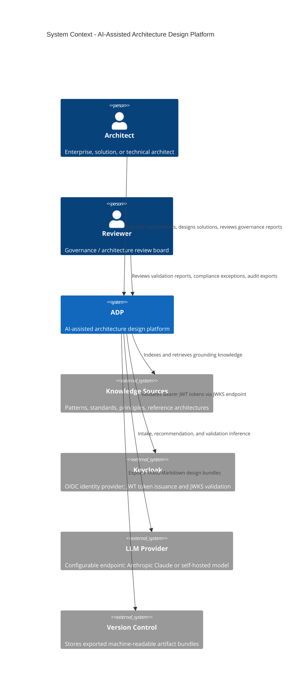
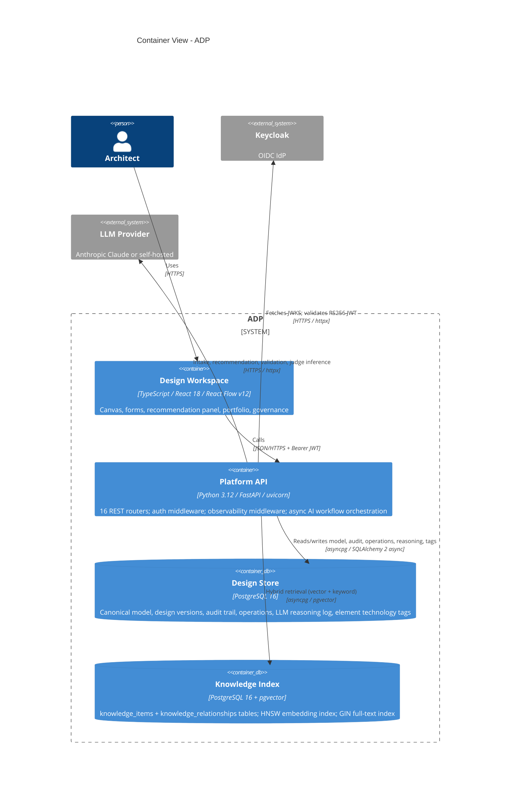

## Document Metadata

This document is the canonical, human-readable rendering of a machine-readable architecture description. The platform it describes ("ADP") is itself an instrument for producing architecture, so this document deliberately follows the same conventions ADP enforces on its own outputs: stable section headers, typed front matter, fenced code blocks with explicit languages, and tabular data rather than prose where the content is structured.

| Field | Value |
|---|---|
| Product | AI-Assisted Architecture Design Platform (ADP) |
| Document scope | High-level solution architecture |
| Audience | Enterprise, solution, and technical architects |
| Source of truth | Structured artifacts (YAML/JSON), not this prose |
| Diagram source | React Flow canvas (`@xyflow/react`); PNG rendered by CairoSVG from locked theme |
| Status | Current — reflects implemented system as of ADP-SPEC-040 |

This document supersedes v0.1.0. All capabilities described here are implemented and tested. Version history: v1.0.0 (ADP-SPEC-035); v1.1.0 (ADP-SPEC-036, Application Registry); v1.2.0 (ADP-SPEC-038, Application Portfolio Management); v1.3.0 (ADP-SPEC-039, Agent Review); v1.4.0 (ADP-SPEC-040, Portfolio-Scope Agent Review).

## Purpose and Scope

ADP is a platform that lets architects design solutions at every level of abstraction — from enterprise landscapes down to technical component designs — with AI assistance grounded in the organization's existing patterns, standards, and principles. It accepts business requirements as input, recommends candidate solutions drawn from a curated knowledge base, provides a governed C4 diagramming surface with a fixed visual language, validates every design against enterprise standards using an LLM-as-a-Judge evaluation layer, and exposes the resulting design portfolio for cross-cutting governance and reporting.

In scope: requirements intake and normalization, AI-driven solution recommendation with persistent reasoning logs, C4 visual design with locked styling, automated design validation, knowledge base management, design lifecycle management (draft → current → decommissioned), cross-portfolio technology analysis, governance reporting and audit export, CALM pattern import/export, and the persistence of all design artifacts as machine-readable data.

Out of scope: build/deployment automation of the designed solutions themselves, cost management tooling, and runtime observability of deployed solutions. ADP designs solutions; it does not operate them.

The defining constraint that shapes the entire architecture is that **every artifact ADP produces is machine-readable first and human-readable second**. Prose documents and rendered diagrams are projections of an underlying typed model, never the primary record. This makes designs queryable, diffable, gate-able in CI, and consumable by other AI systems.

## Architecture Vision

The platform treats an architecture design as data, not as a document or a drawing. An architect interacts with editing surfaces (forms, a diagram canvas, a recommendation panel), but each interaction mutates a single canonical model. Human-readable documents, C4 diagrams, requirements traceability matrices, and validation reports are all generated views over that model. Because the model is typed and versioned, the same design can be rendered for an enterprise audience as a system landscape and for a technical audience as a component decomposition without divergence.

AI is woven through three distinct touchpoints rather than bolted on as a single chatbot: it normalizes incoming requirements into the canonical model, it recommends solution options grounded in retrieved organizational knowledge, and it judges finished designs against standards. Each touchpoint produces structured, cited, auditable output — and every LLM interaction is recorded in a persistent reasoning log for traceability and cost tracking. No AI step is permitted to write to the canonical model without provenance and, where the change is consequential, human confirmation.

## Stakeholders and Personas

ADP serves three architect personas who work at different abstraction levels but on the same underlying model, which is what allows a single design to remain coherent across levels.

| Persona | Primary level | Works with | Cares most about |
|---|---|---|---|
| Enterprise architect | System landscape, C4 L1 (Context) | Capabilities, principles, cross-system dependencies | Alignment to strategy, standards conformance, reuse |
| Solution architect | C4 L2 (Container) | Containers, integrations, NFRs, trade-offs | Buildability, fit to requirements, option comparison |
| Technical architect | C4 L3/L4 (Component/Code) | Components, interfaces, technology choices | Correctness, detailed design, technical standards |

Secondary stakeholders include governance and review boards (who consume validation reports, compliance exception lists, and audit exports), and downstream delivery teams (who consume the machine-readable design as the contract for what to build).

## Architecture Principles

These principles govern ADP itself and are the seed set ADP ships with for evaluating designs built on it. They are stored as typed records so the recommendation and validation subsystems can reference them directly.

| ID | Principle | Implication |
|---|---|---|
| ADP-PR-01 | Model is the source of truth | Documents and diagrams are generated, never hand-edited as primaries |
| ADP-PR-02 | Everything machine-readable | All outputs conform to a published schema with typed metadata |
| ADP-PR-03 | Grounded AI only | Recommendations and judgments must cite retrieved knowledge, not invent it |
| ADP-PR-04 | Provenance on every change | Each model mutation records its origin (human or AI), inputs, and rationale |
| ADP-PR-05 | Fixed visual language | Diagram styling is locked and non-overridable to guarantee consistency |
| ADP-PR-06 | Human-in-the-loop for consequence | AI proposes; a human confirms before consequential commits |
| ADP-PR-07 | Traceability end to end | Every component traces to a requirement, principle, and validation verdict |
| ADP-PR-08 | Every LLM interaction is logged | Token counts, latency, model ID, and prompt context recorded for auditability |
| ADP-PR-09 | Lifecycle state is mandatory | Designs carry a formal lifecycle status from creation to decommission |

## Solution Capabilities

The platform's capabilities map to architect personas. Each capability is owned by a subsystem described later in this document.

| Capability | Description | Owning subsystem |
|---|---|---|
| Requirements intake | Ingest text or structured requirements, normalize to canonical model via LLM | Requirements Intake |
| Pattern-grounded recommendation | Recommend solutions using patterns, standards, principles, prior solutions | AI Recommendation Engine |
| Multi-level C4 design | Interactive canvas at context, container, and component levels | C4 Visual Design |
| Consistent visual language | Locked color/shape theme applied at render time; architects cannot override | Locked Theme Renderer |
| Automated design validation | Judge designs against standards, patterns, prior solutions; fan-out critic model | LLM-as-a-Judge |
| Knowledge base management | CRUD for patterns, standards, principles with vector embedding and hybrid search | Knowledge Retrieval |
| CALM export/import | Export designs to Cloud Architecture Language and Mapping (CALM) JSON; import CALM patterns | CALM Integration |
| Design lifecycle management | Formal lifecycle transitions (draft → proposed → current → deprecated → decommissioned) with date tracking | Lifecycle Management |
| Element technology tags | Tag C4 elements with structured technology and vendor metadata | Technology Tags |
| Portfolio analysis | Cross-portfolio aggregation by technology, lifecycle status; dependency search | Portfolio Analysis |
| Governance reporting | Per-design audit trail aggregation, compliance exception extraction, paginated activity feed, CSV export | Governance Reporting |
| Business architecture | 3-level business capability model (L1 Strategic → L2 Operational → L3 Granular) and ordered value streams with stages | Business Architecture |
| Application registry | Map applications to business capabilities, technical capabilities, value stream stages, and solution designs; track TIME/R-strategy/pace/health-score classification | Application Registry |
| Application portfolio management | Rationalization quadrant, identity fields, risk & compliance register, TCO/cost tracking, technical fit, decommission roadmap + transformation initiatives, ownership & governance, quality & performance signals | Application Portfolio Management |
| LLM reasoning log | Persistent log of every LLM interaction with token counts, cost estimates, and span metadata | Reasoning Store |
| Machine-readable output | Persist and export all artifacts as typed, queryable data; YAML/Markdown bundles to VCS | Documentation Model |
| Traceability | Thread requirements through design to recommendation to validation verdict | Canonical Data Model |

## System Context (C4 Level 1)

At the context level, ADP sits between architects and the organizational knowledge it grounds itself in.



## Container Architecture (C4 Level 2)

ADP is a single deployed service — one FastAPI application hosting all capabilities as routers — backed by PostgreSQL and served with a React SPA. The original architecture anticipated separate intake, recommendation, and validation containers; the implemented architecture deliberately consolidates them into one process to minimize operational complexity while retaining logical separation through Python module boundaries and LangGraph workflow isolation.



All AI orchestration (requirements intake, recommendation, LLM-as-judge) runs as in-process LangGraph workflows within the Platform API. Long-running workflows are tracked as `operations` records in PostgreSQL rather than in-memory, giving them crash recovery and cross-request status visibility.

## Web Application Shell and Design System

The React SPA (ADP-SPEC-037) presents every screen inside a single persistent application shell — a left navigation rail plus a top bar — rendered once at the `App` level, with page components mounted in the scrollable content area. The rail groups destinations into **Workspace** (Overview, Designs), **Architecture** (Business, Applications, Portfolio, Governance, Knowledge), and a per-design **Design** group (Intake, Recommendations, Canvas) that appears only when a design is selected. Navigation destinations are defined once — as `NavDef[]` arrays in `web/src/ui/AppShell.tsx` — and no screen declares its own navigation, replacing the earlier per-page `NavBar` (ADP-SPEC-025 FR-005–008, now superseded).

The landing view is a live **Overview** dashboard that fetches portfolio KPIs from existing endpoints (portfolio summary, applications, integrations, capabilities, value streams, domains, knowledge) and links into each domain. It holds no hard-coded figures and degrades to error and empty states on query failure.

All screens are built from a shared design system in `web/src/ui`: design tokens (`tokens.css` — spacing, radius, elevation, surface/ink/border, accent, semantic, and per-domain hues) and primitives (`Card`, `Panel`, `Button`, `StatusBadge`, `PageHeader`, `KpiTile`). Theming supports light, dark, and system modes, defaulting to the operating-system preference and persisting the user's choice. The application design system governs chrome only; the locked C4 diagram theme (ADP-SPEC-010, ART-XII) is unchanged and remains the sole authority for rendered diagram styling.

## Platform API — Router Inventory

The Platform API exposes 23 FastAPI routers grouped by domain. All routes are prefixed `/api/v1/`.

| Router prefix | Spec | Purpose |
|---|---|---|
| `/designs` | ADP-SPEC-002 | Design CRUD, version history, diff |
| `/designs/{id}/layout` | ADP-SPEC-009 | Canvas element position persistence |
| `/designs/{id}/lifecycle` | ADP-SPEC-030 | Lifecycle status transitions and date tracking |
| `/designs/{id}/render` | ADP-SPEC-010 | PNG diagram generation via CairoSVG |
| `/designs/{id}/tags` | ADP-SPEC-029 | Element technology tag CRUD |
| `/designs/{id}/documents` | ADP-SPEC-011 | Human-readable document generation |
| `/designs/{id}/export` | ADP-SPEC-011 | YAML/Markdown bundle export to VCS |
| `/designs/{id}/calm` | ADP-SPEC-022 | CALM JSON export; CALM pattern import |
| `/intake` | ADP-SPEC-006 | Requirements text intake and LLM normalization |
| `/recommend` | ADP-SPEC-007 | Solution recommendation workflow (LangGraph) |
| `/knowledge` | ADP-SPEC-005/020 | Knowledge item CRUD with vector indexing |
| `/portfolio` | ADP-SPEC-031 | Cross-portfolio technology + lifecycle aggregation |
| `/governance` | ADP-SPEC-032 | Per-design governance status, compliance exceptions, activity feed, CSV export |
| `/reasoning` | ADP-SPEC-027 | LLM reasoning log queries |
| `/theme` | ADP-SPEC-010 | Locked C4 theme JSON |
| `/health` | ADP-SPEC-012 | Liveness check; Prometheus metrics scrape |
| `/config` | ADP-SPEC-015 | LLM provider endpoint configuration |
| `/business` | ADP-SPEC-033/034 | Business capability hierarchy CRUD, value stream + stage CRUD, capability–design links, value-stream–design links, and design business context reverse-lookup |
| `/applications` | ADP-SPEC-036 | Application CRUD with TIME/R-strategy/pace-layer/health-score fields; capability links, tech-cap links, stage links, domain integrations, design links |
| `/technical-capabilities` | ADP-SPEC-036 | Technical capability hierarchy CRUD; 3-level max; parent-delete blocked when children exist |
| `/integrations` | ADP-SPEC-036 | Point-to-point application integration registry; self-loop rejected; bidirectional permitted; filterable by app_id |
| `/applications/rationalization` | ADP-SPEC-038 (US1) | TIME quadrant projection: business value × health score |
| `/applications/{id}/risk`, `/applications/risk/out-of-support` | ADP-SPEC-038 (US3, sensitive) | Risk & compliance register; out-of-support report |
| `/applications/{id}/cost`, `/applications/cost/rollup` | ADP-SPEC-038 (US4, sensitive) | TCO by cost bucket; business-unit rollup |
| `/applications/roadmap`, `/transformation-initiatives`, `/applications/{id}/initiative-links` | ADP-SPEC-038 (US6) | Decommission roadmap; transformation initiative CRUD + membership |
| `/applications/{id}/governance`, `/applications/governance/renewals-soon` | ADP-SPEC-038 (US7, sensitive) | Ownership & governance (contract, renewal, SLA, sponsor) |
| `/applications/{id}/quality` | ADP-SPEC-038 (US8) | Quality & performance signals — advisory, never overrides `health_score` |
| `/search` | ADP-SPEC-038 (groundwork) | Unified hybrid keyword+vector search over the `searchable_items` generated column (migration 011) |

Every response carries `X-Trace-ID`, `X-Content-Type-Options`, `X-Frame-Options`, `Cross-Origin-Resource-Policy`, and `Referrer-Policy` headers applied by the observability middleware.

## Requirements Intake Subsystem

The intake subsystem accepts requirements as free-text or structured form input and normalizes them into typed `Requirement` model records using an LLM call instrumented with OpenTelemetry spans. Each LLM interaction is recorded in the reasoning log (token count, latency, model ID, prompt excerpt). Extracted proposals are presented to the architect for confirmation before entering the canonical model, satisfying the human-in-the-loop principle.

The normalized requirement is the anchor for traceability. Every recommended option, every component placed on a diagram, and every validation verdict threads back to the requirement that justifies it.

```python
class RequirementKind(StrEnum):
    FUNCTIONAL = "functional"
    NON_FUNCTIONAL = "non_functional"
    CONSTRAINT = "constraint"
    DRIVER = "driver"

class Requirement(BaseModel):
    id: RequirementId          # e.g. REQ-014
    statement: str
    kind: RequirementKind
    source: str                # origin document or input
    confirmed_by: str | None = None
```

The intake UI (`IntakePage`) renders extracted proposals as cards; the architect accepts or rejects each before it becomes a confirmed `Requirement`. Confirmation triggers an audit entry with origin `human`.

## Knowledge Base and Pattern Repository

The knowledge base stores the organization's patterns, standards, principles, and prior approved solutions as typed `KnowledgeItem` records, each carrying full text, structured metadata, and a sentence-transformer embedding. Hybrid retrieval combines HNSW vector similarity (via pgvector) with GIN-indexed keyword search (`tsvector`), and `KnowledgeRelationship` records capture cross-item links (e.g. "this pattern implements principle ADP-PR-03").

Knowledge items are indexed from upstream sources via Git connectors (`gitpython`) parsing Markdown/YAML files with frontmatter. When a standard changes upstream, re-indexing updates embeddings without forking the source.

| Knowledge type | Role in recommendation | Role in validation |
|---|---|---|
| Patterns | Building blocks for candidate options | Conformance target |
| Reference architectures | Templates to adapt | Comparison baseline |
| Standards | Constraints on options | Pass/fail criteria |
| Principles | Ranking and trade-off lens | Conformance target |
| Prior solutions | Precedent and reuse | Consistency baseline |

The `KnowledgePage` component provides full CRUD: architects can add, edit, and delete knowledge items through the UI, with immediate re-embedding on save.

## AI Recommendation Engine

The recommendation engine turns confirmed requirements into ranked, justified solution options. It runs as a LangGraph graph inside the Platform API, with individually inspectable steps: retrieve relevant knowledge, generate candidate options, score and rank them, and record reasoning. Every option carries explicit citations — the exact knowledge item IDs it draws on — so an architect can see precisely why a recommendation was made.

Accepting a recommendation is an explicit architect action that materializes the chosen option as `Element` and `Relationship` records in the canonical model, with provenance linking each element back to the recommendation ID and the knowledge it cites. Every LLM call within the workflow is recorded in `llm_reasoning_log` with token counts and cost estimates.

The recommendation workflow state is persisted as an `operations` record in PostgreSQL, allowing status polling across requests and crash recovery on server restart. The `ReasoningPanel` UI component surfaces the per-step reasoning trace to the architect.

The engine also draws on the organisation's own **application landscape** (ADP-SPEC-007 registry grounding): a `reuse` pipeline node ranks the application registry against the requirements and offers matching applications to the generation step as reuse candidates, so an option can prefer reusing an existing application over a net-new build. Reuse ids returned by the model are validated against the offered pool — a hallucinated application id is discarded.

**Feedback loop (ADP-SPEC-019).** Accepting or rejecting an option writes a durable knowledge item (`accepted_recommendation` / `rejected_recommendation`, with the architect's reason and provenance) that is retrieved on subsequent runs for similar requirements. The loop is closed on both sides of the pipeline: the generation prompt labels retrieved decisions as ACCEPTED PATTERN (prefer) or REJECTED PATTERN (avoid), and the deterministic ranking step consumes the signal via a bounded `history_score` — an option that cites a previously accepted decision is boosted, one citing a rejected decision is penalised. Over time the platform's recommendations align with the decisions the organisation has actually made.

```python
class SolutionOption(BaseModel):
    id: OptionId               # e.g. OPT-003
    summary: str
    grounded_on: list[str]     # knowledge item IDs cited
    satisfies: list[str]       # RequirementIds addressed
    tradeoffs: dict[str, str]  # NFR/principle -> assessment
    rank: int
```

## C4 Visual Design Subsystem

The design canvas is a React Flow (`@xyflow/react` v12) SPA that renders the canonical model as an interactive C4 diagram. Placing an element creates a typed `Element` record; drawing an arrow creates a typed `Relationship` record. Diagram state and the underlying data never drift because the canvas is a projection of the model, not an independent artifact.

Canvas layout positions (node coordinates) are persisted separately via `PUT /api/v1/designs/{id}/layout`, keeping layout state out of the canonical model while still surviving browser refreshes. The `InspectionPanel` sidebar provides element property editing, including technology tag management and relationship descriptions.

The platform does not use Structurizr DSL. Diagrams are rendered directly from the React canvas for interactive editing and from the locked theme via CairoSVG for static PNG export. Both paths produce the same visual language.

## Locked Theme Renderer

Diagram styling is defined in `c4-theme.json`, a machine-readable artifact validated against a JSON Schema generated from the `LockedTheme` Pydantic model. Architects cannot override colors, shapes, or fonts — styling is a property of the element's type, applied automatically.

PNG rendering is performed by CairoSVG (`cairosvg >= 2.7`), which consumes SVG generated from the canonical model and theme. No Java or Structurizr runtime is required. The render endpoint is `POST /api/v1/designs/{id}/render`.

The updated WCAG AA-compliant palette:

| Element type | Fill | Stroke | Text | Shape |
|---|---|---|---|---|
| Person / Actor | `#08427B` | `#052E56` | `#FFFFFF` | Person |
| Software System (in scope) | `#1168BD` | `#0B4884` | `#FFFFFF` | RoundedBox |
| External System | `#999999` | `#6B6B6B` | `#FFFFFF` | RoundedBox |
| Container | `#2874A6` | `#1A5276` | `#FFFFFF` | RoundedBox |
| Component | `#85BBF0` | `#5D9BD8` | `#1A1A1A` | Component |
| Datastore | `#2E7D32` | `#1B5E20` | `#FFFFFF` | Cylinder |
| Boundary | none | `#444444` | `#444444` | DashedBox |
| Relationship | n/a | `#707070` | `#444444` | Solid line |
| Async relationship | n/a | `#707070` | `#444444` | Dashed line |

The container fill was updated from `#438DD5` to `#2874A6` (contrast ratio ≥ 4.5:1 against white text, meeting WCAG AA). The theme is versioned alongside the schema; a color change is a deliberate, reviewable event.

## LLM-as-a-Judge Validation Subsystem

Validation evaluates a design against the organization's standards, patterns, and prior approved solutions and produces a structured verdict. The judge runs as a LangGraph fan-out: independent critic nodes each scoped to one dimension (standards conformance, principles alignment, pattern fit, consistency with prior solutions) retrieve relevant knowledge and score the design against a fixed rubric. Each critic must cite the exact knowledge item it is judging against. An aggregation node combines critic verdicts into an overall result.

Verdicts are machine-readable, not prose opinions. Each `Finding` identifies the design element at fault, the violated standard or principle, a severity, and a citation. Gating is deterministic on critic scores. A human reviewer can override any verdict with a recorded justification. Verdicts are written to the audit trail linked to the design version they evaluated.

```python
class Finding(BaseModel):
    id: FindingId              # e.g. FND-002
    element_id: str
    violated: str              # knowledge item ID
    severity: Literal["info", "minor", "warning", "critical"]
    summary: str
    source: str | None         # citation

class Verdict(BaseModel):
    id: VerdictId              # e.g. VRD-001
    design_version: str
    score: float               # 0.0 – 1.0
    status: VerdictStatus      # pending / accepted / rejected / deferred
    findings: list[Finding]
    reviewer_override: str | None = None
```

The `ComplianceTab` in the Governance UI surfaces FAIL and ADVISORY findings extracted from design JSONB across all designs, enabling portfolio-level compliance tracking.

## CALM Integration

ADP exports designs to and imports patterns from the Cloud Architecture Language and Mapping (CALM) JSON format. Export (`GET /api/v1/designs/{id}/calm/export`) maps ADP elements and relationships to CALM nodes and edges. Import (`POST /api/v1/designs/{id}/calm/import`) reads a CALM document and creates corresponding elements and relationships in the target design, with each imported element attributed to its CALM source. This provides interoperability with tooling that speaks CALM and allows the knowledge base to be seeded from externally authored CALM pattern libraries.

## Design Lifecycle Management

Every design carries a formal `lifecycle_status` enforced at the database and API layers. Status transitions follow a defined state machine; invalid transitions are rejected at the API with a 422. Five date columns track the history of each transition.

```
draft → proposed → current → deprecated → decommissioned
                              ↑
                         (from current)
```

| Status | Meaning | Date column |
|---|---|---|
| `draft` | Work in progress, not submitted for review | `created_at` |
| `proposed` | Submitted for architecture review | `proposed_date` |
| `current` | Approved and live | `current_since` |
| `deprecated` | Superseded; retained for reference; `review_due` tracks planned removal | `review_due` |
| `decommissioned` | Formally retired | `retirement_date` |

The `LifecycleTransitionButton` UI component surfaces valid next transitions for the current status. The `designs` table carries `lifecycle_status`, `proposed_date`, `current_since`, `review_due`, and `retirement_date` columns added by Alembic migration 006; the column is B-tree indexed for portfolio queries.

## Element Technology Tags

C4 elements (containers and components) can be tagged with structured technology metadata via `element_technology_tags`. Each tag records the element ID, element name, technology name, and vendor. Tags are indexed for efficient portfolio-level technology queries.

The `TechnologyEditor` sidebar component provides tag CRUD within the inspection panel. Tags are stored in their own table (migration 005) rather than inside the JSONB `content` column, giving them first-class queryability for portfolio analysis.

```python
class TechnologyMetadata(BaseModel):
    technology: str | None = None   # e.g. "PostgreSQL"
    vendor: str | None = None       # e.g. "Amazon Web Services"
```

## Portfolio Analysis

The portfolio router (`/api/v1/portfolio`) provides four read-only aggregation endpoints that operate across all designs without requiring new database tables — they query the B-tree and GIN indexes already present on `element_technology_tags` and `designs.lifecycle_status`.

| Endpoint | Purpose |
|---|---|
| `GET /portfolio/technologies` | Technology landscape: distinct technology names ranked by design count |
| `GET /portfolio/designs` | Filterable design list by technology (ILIKE) and/or lifecycle status |
| `GET /portfolio/search` | Cross-design keyword search across element names and technology tags |
| `GET /portfolio/summary` | Header counts: total designs, counts by lifecycle status, overdue review count |

The `PortfolioPage` frontend presents the technology landscape, filterable design list, dependency search, and a "Governance Report" button that opens the `GovernancePage`. Designs with a `review_due` in the past are flagged `overdue_review: true`.

## Governance Reporting

The governance router (`/api/v1/governance`) provides four read-only endpoints that aggregate across `audit_entries`, `designs`, `design_versions.content` (JSONB), `operations`, and `llm_reasoning_log`. No new migrations are required.

| Endpoint | Purpose |
|---|---|
| `GET /governance/status` | Per-design summary: last activity, audit count, accepted recommendations, LLM reasoning record count |
| `GET /governance/exceptions` | FAIL and ADVISORY findings extracted from design JSONB, sorted FAIL-first |
| `GET /governance/activity` | Paginated audit log filtered by date range (max 90 days), optional action/actor filters |
| `GET /governance/activity/export` | CSV stream of the same query; `Content-Disposition: attachment` response |

The `GovernancePage` frontend presents three tabs: Design Status, Compliance, and Activity Feed. The Activity Feed includes date range pickers, action/actor filter fields, and a "Download CSV" button.

Dynamic SQL clause building is used throughout the governance router to avoid the asyncpg NULL-typed-parameter and SQLAlchemy `::text` cast incompatibility: filter clauses are only appended to the query when the caller provides a value.

## LLM Reasoning Store

Every LLM call made anywhere in the platform — intake, recommendation, validation, judge — is recorded in `llm_reasoning_log` (migration 004). Each record carries:

- `operation_id` — links to the async operation that triggered the call
- `step_name` — the LangGraph node or pipeline step
- `model_id` — the model endpoint called
- `prompt_tokens`, `completion_tokens`, `total_tokens` — for cost tracking
- `latency_ms` — wall time of the LLM call
- `trace_id` — OpenTelemetry trace ID for correlation
- `created_at`

The `ReasoningPanel` component surfaces the reasoning chain for a completed recommendation, showing the architect how the engine arrived at each option. The governance `/status` endpoint aggregates reasoning record counts per design. The `GET /api/v1/reasoning` endpoint supports querying reasoning records by operation or design.

## Machine-Readable Documentation Model

Every artifact ADP produces — designs, requirements matrices, recommendation records, validation reports, and human-readable documents — conforms to a published schema and carries typed metadata. Human-readable documents are generated as projections of the model via the `adp.docs` module and stamped with front matter that mirrors the model's fields.

Export bundles (`adp.export`) produce YAML/Markdown archives pushed atomically to a configured VCS root. Export requires an `ART-VIII confirmation_id` gate and writes an `ART-IX` audit entry. Export targets: canonical YAML model, rendered Markdown document, and CALM JSON.

## Canonical Data Model

The canonical model is the single source of truth. The top-level `ArchitectureDescription` is persisted as JSONB in `design_versions.content`, versioned immutably; the current version pointer lives in the `designs` row. Schema evolution is governed by `SCHEMA_VERSION` in `adp.models` and validated at read/write boundaries.

```python
class ArchitectureDescription(BaseModel):
    id: str
    version: str                          # e.g. "1.0.0"
    title: str
    lifecycle_status: LifecycleStatus     # ADP-SPEC-030
    requirements: list[Requirement]
    elements: list[Element]
    relationships: list[Relationship]
    recommendations: list[SolutionOption]
    verdicts: list[Verdict]
    findings: list[Finding]               # compliance exceptions
```

All identifier types are typed string aliases validated by regex (`REQ-\d{3}`, `ELM-\d{3}`, etc.), making cross-entity references checkable at model load time. A generated JSON Schema (`generated/architecture-description.schema.json`) is the machine-readable contract; it is regenerated by `adp-generate` and checked for drift in CI.

## Business Architecture

The business architecture module (`adp.business`) provides CRUD for a 3-level capability hierarchy, ordered value streams, and bidirectional traceability links connecting business entities to solution designs.

**Capability model**: Capabilities are organized as an adjacency list (`parent_id` self-referential FK) with a hard depth limit of 3 levels enforced at the API layer:

| Level | Label | Examples |
|---|---|---|
| 1 | Strategic (L1) | "Customer Experience", "Supply Chain" |
| 2 | Operational (L2) | "Order Management", "Fulfilment" |
| 3 | Granular (L3) | "Credit check", "Route optimization" |

The flat list is fetched once and assembled into a tree client-side (`buildTree()` in `CapabilityTree.tsx`), avoiding recursive SQL. L1 capabilities must have `parent_id = null`; L2/L3 must reference a parent at the immediately higher level — validated by a Pydantic `@model_validator`. Deleting a capability with children returns 409 Conflict with a child count message.

**Value streams**: Each value stream is a named, stakeholder-attributed sequence of stages. Stages carry an explicit `position` integer; the `PUT /api/v1/business/value-streams/{id}/stages` bulk-reorder endpoint replaces the ordered stage list atomically (deletes removed stages, updates positions 0..n-1 in a single transaction). Deleting a value stream cascades to its stages via FK.

**Traceability links** (ADP-SPEC-034): Two composite-PK join tables (`capability_design_links`, `value_stream_design_links`) record which solution designs support each capability or value stream. Both FK legs use `ON DELETE CASCADE`, so deleting a capability/value stream or a design automatically removes its links. The `GET /api/v1/business/designs/{id}/context` endpoint provides the reverse lookup — given a design ID, it returns all capabilities and value streams linked to it. This endpoint is surfaced in the `IntakePage` sidebar as `BusinessContextPanel`. `DesignLinkEditor` is a shared reusable React component used in both `CapabilityNode` (inline "Links" panel) and `ValueStreamDetail` ("Supporting Designs" section).

**Business Domain Registry** (ADP-SPEC-035): Domains are first-class entities that classify groups of L1 capabilities. Each domain carries a name, scope statement (in/out), a three-value classification (`strategic | differentiating | commodity`), an org unit, and a `TEXT[]` risk flag array (`PII`, `GDPR`, `CIFIUS`, etc.). The `business_domains` table has a CHECK constraint on classification to guard against invalid values at the DB layer. L1 capabilities reference their domain via a nullable `domain_id` FK with `ON DELETE SET NULL` — deleting a domain atomically clears `domain_id` on all its capabilities without a loop. Only L1 capabilities may be assigned to a domain (enforced at the API layer, 422 for L2/L3). The `PATCH /api/v1/business/capabilities/{id}/domain` endpoint handles both assign and clear with a single nullable body field.

Stage-capability mapping connects value stream stages to business capabilities via `value_stream_stage_capabilities`, a join table with composite PK `(stage_id, capability_id)` and `ON DELETE CASCADE` on both FK legs. A reverse index `ix_vssc_capability_id` on `capability_id` is created now to support a future capability landing page without requiring an additional migration. `StageCapsEditor` is an inline React component that appears inside each stage card in `ValueStreamStageEditor`, showing linked capabilities with domain context and a capability picker dropdown.

The `DomainDetail` view in `BusinessPage` ("Domains" third tab) shows all assigned L1 capabilities and allows assignment changes. Domain badges appear on L1 capability nodes in the `CapabilityTree` view. Frontend types (`BusinessCapability`) include `domain_id` and `domain_name` fields populated via LEFT JOIN in all capability queries.

Structured `logger.info()` is used for audit logging rather than `audit_entries` — the audit_entries table requires a `design_id` FK and globally-unique `AUD-NNN` ID generation from the full ArchitectureDescription JSONB; writing link mutations through it would create spurious design versions. ART-IX is SHOULD for this module; structured logging satisfies ART-VI.

## Application Registry

The application registry module (`adp.application`, ADP-SPEC-036) provides first-class CRUD for software applications and the network of relationships that connect them to the rest of the architecture model. It sits alongside the business architecture module and provides the "application" layer that bridges business architecture down to solution designs.

**Application entity**: Each application carries strategic classification fields that align to enterprise portfolio management frameworks:

| Field | Values | Purpose |
|---|---|---|
| `time_classification` | Tolerate / Invest / Migrate / Eliminate | Portfolio disposition (TIME framework) |
| `r_strategy` | Rehost / Replatform / Repurchase / Refactor / Retire / Retain / Relocate | Migration/modernisation strategy (7R) |
| `pace_layer` | Record / Differentiation / Innovation | Pace-layer classification |
| `health_score` | 1–5 integer | Subjective health indicator; CHECK constraint at DB and Pydantic |

**Technical capability hierarchy**: A separate 3-level tree (`technical_capabilities` table, adjacency-list self-referential FK) records the technical capabilities an organisation can deliver, independent of any single application. The depth limit is enforced at the API layer (422 on attempt to add a 4th level); deleting a parent with children returns 409 Conflict. Levels are derived from the parent, not stored explicitly on the creating payload.

**Linkage tables**: Seven join tables connect applications to the rest of the model:

| Table | Cardinality | Key constraint |
|---|---|---|
| `application_capability_links` | application ↔ business_capability | Composite PK (app_id, cap_id); `fit_score` 1–5 |
| `application_tech_cap_links` | application ↔ technical_capability | Composite PK (app_id, tc_id, usage_type); same app may both `provides` and `consumes` the same tech cap |
| `application_stage_links` | application ↔ value_stream_stage | Composite PK (app_id, stage_id); CASCADE on stage delete |
| `application_domain_integrations` | application ↔ business_domain | UUID PK; `direction` inbound/outbound/bidirectional; CASCADE on domain delete |
| `application_integrations` | application ↔ application | UUID PK; `source_app_id ≠ target_app_id` CHECK; CASCADE when either endpoint is deleted; bidirectional (A→B + B→A) permitted |
| `application_design_links` | application ↔ design | Composite PK (app_id, design_id); design existence checked at API layer (404 on miss) |

**Audit logging**: Structured `logger.info()` is used rather than `audit_entries` rows, consistent with the business architecture module's approach (ART-IX SHOULD; `audit_entries` requires a `design_id` FK not applicable here).

**Frontend**: The `ApplicationPage` view provides a sidebar list of applications (with TIME colour badges and health-score stars) and a tabbed detail panel with sections for Overview, Business Capabilities, Technical Capabilities, Value Stream Stages + Domain Integrations, Integrations, and Linked Designs. `TechCapTree.tsx` renders the technical capability hierarchy as an interactive indented tree with inline add/delete. Three router prefixes (`/applications`, `/technical-capabilities`, `/integrations`) are registered in `adp.api.app`.

## Application Portfolio Management

The application portfolio management epic (`adp.application`, ADP-SPEC-038) extends the ADP-SPEC-036 application registry with eight user stories (US1–US8), each adding a focused 1:1 table or link table to the `applications` entity rather than growing a single monolithic record. All eight stories share one implementation pattern: a full-replace upsert (`get_application_X` / `upsert_application_X` — a partial-body PUT always overwrites the whole row, never a field-by-field PATCH) and, for US3/US4/US7 only, a dedicated sensitive-read gate.

**US1 — Rationalization** (migration 012): `GET /applications/rationalization` projects every application onto a TIME quadrant (Tolerate/Invest/Migrate/Eliminate) from `business_value × health_score`, splitting the result into assessed and unassessed sets.

**US2 — Identity**: additional identity fields on the base `Application` record (no separate table); non-sensitive, covered by the existing `WRITE_APPLICATION` prefix rule.

**US3 — Risk & compliance register** (migration 014, sensitive): `application_risk` records security posture, vulnerability status, data classification, regulatory tags, DR/BC status, end-of-life/end-of-support dates. `GET /applications/risk/out-of-support` reports applications past their `end_of_support_date`. Gated by `READ_APPLICATION_RISK` / `WRITE_APPLICATION_RISK`.

**US4 — Total cost of ownership** (migration 015, sensitive, ADP-9x6): `application_cost` tracks eight cost buckets (acquisition, implementation, training, operational, maintenance, upgrades, risk/downtime, end-of-life), each with a one-time and an annual `Money` figure, plus currency and horizon-years. `GET /applications/cost/rollup` aggregates TCO by business unit. Money is `Decimal` on the backend and serializes as a JSON string — the web layer never parses it back into a number except for display formatting. Gated by `READ_APPLICATION_COST` / `WRITE_APPLICATION_COST`.

**US5 — Technical fit** (migration 016): additional fields on the base `Application` record scoring fit against the technical capability hierarchy; non-sensitive, no separate endpoint — the web `TechFitPanel` reads directly from the application object.

**US6 — Roadmap & transformation initiatives** (migration 017): `transformation_initiatives` (name, description, target date) group applications under a planned disposition (retire/replace/modernize/invest) via `application_initiative_links`. `GET /applications/roadmap` lists Eliminate-classified or sunset/retired applications together with their initiative memberships — a decommission planning view. Non-sensitive.

**US7 — Ownership & governance** (migration 018, sensitive): `application_contracts` records contract terms, renewal date, SLA, business sponsor, IT owner, and decision rights. `GET /applications/governance/renewals-soon` (default 90-day window, `within_days` override) surfaces contracts approaching renewal. Gated by `READ_APPLICATION_GOVERNANCE` / `WRITE_APPLICATION_GOVERNANCE`.

**US8 — Quality & performance signals** (migration 019): `application_quality_metrics` records uptime %, YTD incident count, a 1–5 user satisfaction score, a free-text performance note, and 30-day support ticket volume — all manual/advisory inputs that are explicitly documented to never override the application's `health_score`. Non-sensitive.

**Authorization**: US3, US4, and US7 are the only sensitive categories in the epic — each added its own `READ_`/`WRITE_APPLICATION_{RISK,COST,GOVERNANCE}` `ActionType` pair to `PERMISSION_GRANTS`, bumping `PERMISSIONS_VERSION` from `1.1.0` to `1.4.0` across the three additions (reviewers deliberately do not hold any of the six actions — this data is not open to every reader). US1, US2, US5, US6, and US8 are non-sensitive and ride the pre-existing `WRITE_APPLICATION` prefix rule with open GET reads, the same enforcement pattern the base application registry uses.

**Frontend**: each sensitive-category panel (`RiskPanel`, `CostPanel`, `GovernancePanel`) follows the same shape — a `useApplicationX(appId)` query with `retry: false` and a graceful "you don't have permission" render when the fetch error contains `403`, plus a Save button and toast. The non-sensitive `QualityPanel` and `TechFitPanel` need no 403-handling. All panels are tabs on the shared `ApplicationDetail` component.

## Agent Review

ADP-SPEC-039 provides a reusable "AI expert review" pattern: any screen can add a button that asks an LLM to review one entity and its directly linked context, propose suggestions, and require an explicit human accept/reject before any suggestion touches the database. ADP-SPEC-040 extends this with a *portfolio-scope* review of the whole capability tree at once. The pattern is split into a domain-agnostic toolkit (`adp.agents`, `web/src/agent-review/`) and thin per-domain adapters — Business Capabilities (`adp.business.agent_review`, `web/src/business/agentReviewDetail.tsx`) is the first and, so far, only adapter.

**Toolkit** (`adp.agents`): four modules with zero dependency on any single domain module (`src/adp/business`, `src/adp/application`, etc.), mechanically enforced by `tests/unit/agents/test_toolkit_boundary.py` so a second adapter for a different screen can reuse them unmodified.

- `llm_stub.StubLLMClient` — the shared no-API-key-configured stub, replacing the ad hoc per-router stub duplication that existed in the intake and recommendation routers before this feature.
- `grounding.verify_references` — given a suggestion's citations and a `dict[str, EntityLookup]` (one independent existence-check callable per entity type), re-verifies every cited id actually resolves. An unresolvable citation doesn't discard the suggestion — it marks it `advisory=True`, which the accept endpoint then requires an explicit `advisory_acknowledged=true` to override.
- `provenance.write_suggestion_audit` / `write_suggestion_reasoning` — a structured `origin="ai"` log line plus an `llm_reasoning_log` row (reused as-is, no schema change) for every suggestion, one row per suggestion at *generation* time regardless of later accept/reject, mirroring how the recommendation engine records per-option reasoning.
- `models` — the shared `GroundingCitation`, `GroundingResult`, and the `AgentSuggestionStatus` / `AgentReviewOperationStatus` enums every adapter's suggestion type reuses.

No new tables were added. A review operation reuses the existing `OperationStore` (`operations.design_id`, a plain `TEXT` column with no FK, holds the reviewed entity's id instead of a design id) for submit/poll status tracking, exactly like intake and recommendation.

**Business Capabilities adapter** (`adp.business.agent_review`): reviews one capability and everything directly linked to it — its own fields, assigned domain, parent/children, linked value-stream stages, linked applications (non-sensitive APM fields only — risk/cost/governance data is excluded from the prompt by construction, not by a permission check), linked technical capabilities, and linked designs. Context assembly is direct-links-only, never a subtree or portfolio-wide traversal, keeping the prompt bounded regardless of hierarchy size. The system prompt is loaded from `docs/system_prompt_sr_bus_arch.md` at runtime (falling back to a short built-in prompt if the file is missing), so the persona can be edited without a code change.

Six suggestion types. The first five are per-capability review scope, added incrementally by priority (each strictly higher write-risk than the last); the sixth is portfolio-scope only (ADP-SPEC-040):

| Type | Scope | Writes via | Grounding |
|---|---|---|---|
| `flag_duplicate` | per-capability | *(none — acknowledgment only)* | Cites another capability, same hierarchy level only (FR-011) |
| `reclassify_strategic_relevance` | per-capability | `update_capability` | No citation — targets the reviewed capability's own field |
| `set_maturity_level` | per-capability | `update_capability` | No citation — targets the reviewed capability's own field |
| `assign_domain` | per-capability | `assign_capability_domain` | Cites a `business_domain` id — first cross-entity-type grounding, L1-only, unassigned-only (FR-012) |
| `propose_new_capability` | both | `create_capability` | Cites a *supporting-context* id (an uncovered value-stream stage with zero capability coverage) — there is no "proposed capability id" to cite, since it doesn't exist yet |
| `flag_capability_for_removal` | portfolio only | `delete_capability` | Cites the flagged capability's own id, grounded against the full portfolio (any level) |

**Accept-time re-verification (FR-015, FR-016)**: immediately before writing, accept re-checks that every cited entity still exists and that the *specific field* the suggestion targets is unchanged since generation — a change to an unrelated field does not block acceptance. `reclassify_strategic_relevance` / `set_maturity_level` carry an explicit `previous_*` snapshot captured at generation time; `assign_domain` has none, since FR-012 scopes it to `domain_id IS NULL` capabilities by construction, so its check degenerates to "is it still unassigned"; `propose_new_capability` re-verifies its supporting stage still exists rather than a field snapshot, since it creates a new record instead of overwriting one. Accept also independently re-checks the underlying `WRITE_BUSINESS_ARCH` permission, regardless of whether the caller was permitted to trigger the review or confirm suggestions in general — a `SUBMIT_AI_OPERATION`/`CONFIRM_AGENT_SUGGESTION` grant does not imply write access to the target entity.

**Authorization**: triggering a review reuses the existing `SUBMIT_AI_OPERATION` action (shared with intake/recommend, not duplicated); accepting or rejecting a suggestion uses a new `CONFIRM_AGENT_SUGGESTION` action, added to `REQUIRES_CONFIRMATION` alongside `CONFIRM_RECOMMENDATION` (`PERMISSIONS_VERSION` `1.4.0` → `1.5.0`). Both are registered as explicit route→action overrides in `enforcement.py`, taking precedence over the `/api/v1/business/` prefix's default `WRITE_BUSINESS_ARCH` rule.

**Frontend**: `AgentReviewButton` (trigger + poll + render) and `SuggestionCard` (rationale, citations, advisory acknowledgment, accept/reject) are generic, parameterized by `basePath` and an optional `renderDetail` override — a future second adapter points these at a different `basePath` without modifying either component. `AgentReviewButton` also exposes an `onAccepted` callback, threaded down to each `SuggestionCard`, so the adapter can refresh whatever data a successful accept just wrote to (neither generic component knows about the adapter's own query keys), and a "Close" button that clears the current operation's results independent of whatever toggle the consuming screen uses to show/hide the component. The Business Capabilities adapter supplies `renderCapabilitySuggestionDetail` (in `agentReviewDetail.tsx`) to render a current→suggested transition for the two classification types, the proposed name/description/level for `propose_new_capability`, and a distinct "Flagged for removal" notice for `flag_capability_for_removal`; other types fall through to `SuggestionCard`'s generic field-list rendering. `CapabilityNode` wires a per-capability "Review" toggle; `CapabilityTree` wires a page-level "Review Portfolio" button at the top of the Capabilities tab, pointed at the portfolio-scope `basePath` below.

**Portfolio-scope review** (ADP-SPEC-040): `run_portfolio_review`/`assemble_portfolio_context` in `agent_review.py` are a sibling to the per-capability `run_review`/`assemble_context` — same span/reasoning/failure-handling shape, different context (the *entire* capability tree, grouped by level, plus every value-stream stage with zero capability coverage *portfolio-wide*, via a new single-query `list_all_uncovered_stages` rather than the per-capability N+1 scan). Only `propose_new_capability` (reused verbatim — it never referenced "the reviewed capability" in the first place) and `flag_capability_for_removal` apply at this scope; the other four target one specific capability's own fields by design and stay per-capability only.

New routes (`POST`/`GET /api/v1/business/capabilities/agent-review`, plus accept/reject on suggestions) have no `{cap_id}` path segment — a different segment shape than the per-capability routes, so FastAPI's routing has no ambiguity between them. `operations.design_id` (`NOT NULL`, no FK) holds a `"PORTFOLIO"` sentinel in place of a reviewed entity id. Accept-dispatch is a separate, smaller function from the per-capability endpoint's (rather than threading an optional `cap_id` through the existing one) — lower risk than refactoring an already-shipped, tested code path for two suggestion types that share almost nothing with the other four's accept logic. `flag_capability_for_removal`'s accept calls the existing `delete_capability`, which already 409s if the target has children, exactly like the manual delete button — no new removal-safety logic was needed.

## AI Chat Assistant

ADP-SPEC-041 provides a read-only, cross-domain conversational Q&A assistant — a business architect or business person can ask free-form questions about capabilities, applications, portfolio health, and governance, and get a streamed, grounded reply. It deliberately complements Agent Review rather than duplicating it: Agent Review *proposes changes* to one reviewed entity with an accept/reject gate; chat only *answers questions*, with no write path at all — no grounding/citation/accept-dispatch machinery beyond marking a citation verified or unverified.

**Package** (`adp.chat`): six modules — `models` (Pydantic v2, `extra="forbid"`), `store` (actor-scoped CRUD over migration 022's two new tables), `retrieval` (thin wrapper over `adp.search.hybrid_search`), `tools` (the read-only `TOOL_REGISTRY`), `orchestrator` (per-turn logic), `router` (the four HTTP endpoints). Deliberately **not** a fifth `adp.agents` adapter: that toolkit's whole point (ADP-SPEC-039 SC-005) is zero dependency on any single domain module, but chat's whole point is answering cross-domain questions — the two constraints are incompatible, so chat is its own top-level package instead of stretching `adp.agents`' boundary.

**Two-legged retrieval** (research D4): fuzzy/conceptual questions ("what capabilities relate to returns?") are answered by extending the existing polymorphic hybrid (vector + keyword, RRF-fused) search index — `adp.search` — with three more entity-type discriminators (`ENTITY_APPLICATION`, `ENTITY_VALUE_STREAM`, `ENTITY_BUSINESS_DOMAIN`) alongside the two it already covered (`ENTITY_BUSINESS_CAPABILITY`, `ENTITY_TECHNICAL_CAPABILITY`), with `index_entity`/`unindex_entity` wired into the corresponding store CRUD exactly like capabilities and technical capabilities already were. Precise/aggregate questions ("which capabilities have no domain assigned", a TCO rollup) are answered by a small, fixed, explicitly enumerated `TOOL_REGISTRY` of read-only tool functions (`get_capability`, `get_application`, `get_application_risk`/`_cost`/`_governance`, `portfolio_summary`, `governance_status`) — each a thin wrapper around a function an existing REST endpoint already uses (the two aggregate tools call `adp.api.routers.portfolio.get_portfolio_summary`/`governance.get_governance_status` directly rather than duplicating their raw-SQL queries). `adp.knowledge` (ADP-SPEC-005's curated organizational-knowledge index for the Recommendation Engine) is explicitly the wrong target for either leg — it indexes principles/patterns/ADRs, not live portfolio data.

**Streaming**: `LLMClient` gained `chat_stream()` — multi-turn, tool-use-capable, built on the existing raw-`httpx` pattern (not the official Anthropic SDK, to preserve the dual Anthropic/OpenAI-compatible provider design). It yields normalized events (`text_delta`, `tool_use`, `done`) regardless of provider, parsing Anthropic's `event:`/`data:` SSE framing or OpenAI's `data: {...}`/`[DONE]` framing internally. `POST /api/v1/chat/conversations/{id}/messages` is the platform's first streaming endpoint — a FastAPI `StreamingResponse` emitting `text/event-stream`, consumed client-side via `fetch()` + a manual `ReadableStream` reader rather than the browser's native `EventSource`, since `EventSource` cannot send the `Authorization` header this API requires.

**Tool-use loop** (`orchestrator.run_turn`): when the model requests a tool, the loop dispatches it via `TOOL_REGISTRY`, feeds the JSON result back as a `tool_result` content block, and resumes streaming — bounded by `_MAX_TOOL_ROUNDS = 5` as a safety net against a pathological loop, not a limit expected to bind in ordinary use. A gated tool's handler takes the asking user's `PersonaRole` and returns `{"permitted": False}` — never an error, never a silently-empty result — when `is_permitted(role, ActionType.READ_APPLICATION_*)` fails (research D5): the enforcement point is this code path, not a prompt instruction, so no cleverly-worded question can talk the assistant out of it. This mirrors Agent Review's D6 (excluding sensitive data "by construction, not by permission check") adapted for chat's finer-grained, per-question filtering instead of a blanket exclusion. `TOOL_REGISTRY`'s read-only guarantee is mechanically enforced (`tests/unit/chat/test_tools_boundary.py`, mirroring `test_toolkit_boundary.py`'s approach) by walking each handler's call graph and inspecting the *called* functions' own source for the `.insert()`/`.update()`/`.delete()` idiom every store module's writes use — not just trusting a `get_`/`list_` naming convention.

**Grounding**: inline citations (`[business_capability:<id>]`, `[technical_capability:<id>]`, `[application:<id>]`, `[value_stream:<id>]`, `[business_domain:<id>]`) are stripped from the displayed reply and independently re-verified via the existing `adp.agents.grounding.verify_references` — an unresolvable one is marked `verified: false` rather than silently trusted or discarded (there is no accept-gate to block, since chat never writes anything).

**Persistence** (migration 022, `chat_conversations` + `chat_messages`): the first genuine schema change either Agent Review spec needed — history is real, actor-scoped, resumable CRUD rather than transient `OperationStore` payloads. Every read function (`get_conversation`, `list_conversations`) is actor-scoped by construction — there is no unscoped variant — and a conversation that doesn't exist or isn't owned by the caller is never distinguished, always a 404, never a 403 that would confirm the id is valid.

**Bounded context** (US4, research D8): each turn sends the LLM only the most recent `_CONTEXT_WINDOW_SIZE = 10` messages regardless of how long the conversation actually is, bounding token cost/latency growth on a long conversation — the complete, untruncated history is always what's persisted and what `GET .../conversations/{id}` returns; only the slice sent to the model is windowed.

**Authorization**: a new `ActionType.USE_CHAT_ASSISTANT` gates the two mutating routes (create conversation, send message); unlike `CONFIRM_AGENT_SUGGESTION` it's granted broadly, including to `REVIEWER` (`PERMISSIONS_VERSION` `1.5.0` → `1.6.0`) — it controls feature availability, not data sensitivity, which is handled per-category inside the tool layer instead. It is deliberately not in `REQUIRES_CONFIRMATION`, since it gates a read-only feature, not a consequential write.

**Frontend**: `ChatButton`/`ChatPanel` (`web/src/chat/`) are generic, parameterized by `basePath` only, mirroring `AgentReviewButton`/`SuggestionCard`'s split. `ChatPanel` renders incremental streamed text, past-conversation history (list + resume), and a `Close` affordance, mirroring `InspectionPanel`'s dismiss pattern. First (and so far only) entry point: a "Chat" toggle on the Business Capabilities page, alongside the existing "Review Portfolio" toggle.

## Data Architecture

ADP uses PostgreSQL 16 as its single stateful backing service, serving both the relational model store and the vector knowledge index (via the `pgvector` extension). Nineteen Alembic migrations bring the schema from zero to its current state.

| Migration | Tables added |
|---|---|
| 001 | `designs`, `design_versions`, `audit_entries` |
| 002 | `knowledge_items`, `knowledge_relationships` (HNSW index on `embedding`, GIN on `full_text`) |
| 003 | `operations` (persistent async workflow state) |
| 004 | `llm_reasoning_log` |
| 005 | `element_technology_tags` (B-tree + GIN indexes) |
| 006 | `lifecycle_status`, `proposed_date`, `current_since`, `review_due`, `retirement_date` columns on `designs` |
| 007 | `business_capabilities` (adjacency list, level CHECK 1-3, B-tree indexes), `value_streams`, `value_stream_stages` (CASCADE delete) |
| 008 | `capability_design_links` (composite PK, CASCADE both FKs, index on `design_id`), `value_stream_design_links` (same) |
| 009 | `business_domains` (CHECK on classification, TEXT[] risk_flags), `domain_id` FK on `business_capabilities` (ON DELETE SET NULL), `value_stream_stage_capabilities` (composite PK, CASCADE both FKs, reverse index on `capability_id`) |
| 010 | `applications` (TIME/R-strategy/pace_layer CHECK constraints, health_score 1–5 CHECK), `technical_capabilities` (adjacency-list self-ref FK, RESTRICT on parent delete), `application_capability_links` (composite PK, fit_score 1–5 CHECK), `application_tech_cap_links` (composite PK incl. usage_type, provides/consumes CHECK), `application_stage_links` (composite PK, CASCADE on stage delete), `application_domain_integrations` (direction CHECK, CASCADE on domain delete), `application_integrations` (source≠target CHECK, CASCADE on either endpoint delete), `application_design_links` (composite PK) |
| 011 | Unified `searchable_items` generated full-text-search column for hybrid keyword+vector search (ADP-SPEC-038 groundwork) |
| 012 | ADP-SPEC-038 US1: rationalization scoring fields on `applications` |
| 013 | ADP-SPEC-038 US2: identity fields on `applications` |
| 014 | ADP-SPEC-038 US3 (sensitive): `application_risk` (1:1, CASCADE delete) — security posture, vulnerability status, data classification, regulatory tags (JSON), DR/BC status, end-of-life/end-of-support dates |
| 015 | ADP-SPEC-038 US4 (sensitive, ADP-9x6): `application_cost` (1:1, CASCADE delete) — 8 cost buckets × {one_time, annual} NUMERIC, currency, horizon_years |
| 016 | ADP-SPEC-038 US5: technical-fit fields on `applications` |
| 017 | ADP-SPEC-038 US6: `transformation_initiatives`, `application_initiative_links` (composite PK, planned_disposition CHECK, CASCADE on either endpoint delete) |
| 018 | ADP-SPEC-038 US7 (sensitive): `application_contracts` (1:1, CASCADE delete) — contract terms, renewal_date (partial index where NOT NULL), SLA, business sponsor, IT owner, decision rights |
| 019 | ADP-SPEC-038 US8: `application_quality_metrics` (1:1, CASCADE delete) — uptime_pct, incidents_ytd, satisfaction_score (1–5 CHECK), perf_note, ticket_volume_30d (`head`) |

The `designs` table is the system of record for active design work. `design_versions` is append-only — no row is ever updated or deleted — making the full version history of every design reconstructable. `audit_entries` is similarly append-only. `operations` rows are expired and cleaned up by a background asyncio task that runs every 10 minutes inside the API process.

Exported artifact bundles in VCS serve as the durable, diffable record of published designs and the integration point for downstream consumers.

## Authentication and Authorisation

Authentication is implemented via `AuthMiddleware` (Starlette middleware) that validates RS256 Bearer JWTs issued by Keycloak. On first request, the middleware fetches the JWKS endpoint; the public key set is cached in-process and refreshed on key-not-found errors. Token validation uses `python-jose[cryptography]`.

`ADP_AUTH_ENABLED` (default: `true`) is the runtime toggle. Setting `ADP_AUTH_ENABLED=false` bypasses validation, which is required for local development without Keycloak and for the real-stack E2E test suite.

Authorisation is **action-based**, not a linear role hierarchy: the `PERMISSION_GRANTS` table (`adp.authz.permissions`, version 1.4.0) maps each `PersonaRole` to the set of `ActionType`s it may perform — so a reviewer may `OVERRIDE_VERDICT` yet not `WRITE_DESIGN`. Enforcement is wired at the HTTP layer by a single application-level FastAPI dependency (`adp.authz.enforcement.enforce_route_permission`) installed on the app: every mutating route resolves to a required `ActionType` (via an explicit design/intake/recommend map plus prefix rules for the business, application, and knowledge routers) and a caller lacking that grant is refused with `403` before the endpoint runs. Safe methods (GET/HEAD/OPTIONS) are never gated — which matters for the three sensitive application-portfolio categories (ADP-SPEC-038 US3/US4/US7: risk, cost, governance), whose *reads* also need gating; each adds a dedicated `require_action_dep(ActionType.READ_APPLICATION_X)` dependency on its GET route rather than relying on the app-level dependency. A completeness test fails CI if any mutating route ships without a mapped action, keeping the policy exhaustive. When `ADP_AUTH_ENABLED=false`, the caller is the `ENTERPRISE_ARCHITECT` sentinel (all actions), so local development and the auth-disabled E2E suite are unaffected.

The frontend reads `VITE_AUTH_ENABLED` to decide whether to attach Bearer tokens via the Keycloak JS adapter. When auth is enabled, all API mutations go through `apiMutation()`, which injects the `Authorization: Bearer <token>` header from the Keycloak token store.

Security headers applied to every response: `X-Content-Type-Options: nosniff`, `Cross-Origin-Resource-Policy: same-origin`, `X-Frame-Options: DENY`, `Referrer-Policy: strict-origin-when-cross-origin`. Unhandled exceptions return a generic 500 body without stack-trace disclosure.

## Observability and Telemetry

Observability is implemented in the `adp.telemetry` package (ADP-SPEC-012):

**Tracing**: Every request carries an `X-Trace-ID` (extracted from the header or generated as a UUID). The trace ID is propagated via a `ContextVar` and injected into all log records by `TraceIdFilter`, so logs from a single request are correlatable without a distributed tracing backend.

**Metrics**: Prometheus metrics are scraped at `GET /api/v1/health/metrics`. Four metrics are emitted:
- `adp_requests_total` (counter, labels: method, route, status)
- `adp_request_latency_seconds` (histogram, label: route)
- `adp_active_requests` (gauge)
- `adp_errors_total` (counter, label: route)

**AI step spans**: Each LangGraph step uses the `ai_step_span()` context manager to emit an OpenTelemetry span with canonical attribute names from `adp.telemetry.contract`. LLM call metadata (model ID, token counts, latency) is attached as span attributes and simultaneously persisted to `llm_reasoning_log`.

**No-leak gate**: CI enforces `QG-08` — `ADP_LLM_API_KEY` must never appear in any log, span attribute, test output, or source file.

## Integration and APIs

The Platform API is the single external entrypoint. All payloads conform to the published JSON Schema. The OpenAPI specification (served by FastAPI at `/openapi.json`) is the machine-readable contract for downstream tooling.

Outbound integrations:
- **Keycloak** over OIDC/HTTPS: JWKS fetch and JWT validation
- **LLM provider** over HTTPS: configurable endpoint (Anthropic Claude or self-hosted), set via `ADP_LLM_API_KEY` and `ADP_LLM_BASE_URL`; key is never logged
- **Knowledge sources** via Git: `gitpython` fetches Markdown/YAML from configured repos for knowledge indexing
- **Version control** for export bundles: design YAML/Markdown pushed atomically to `ADP_VCS_ROOT`

AI workflows are exposed as asynchronous operations with status polling (`GET /api/v1/recommend/{op_id}`, `GET /api/v1/intake/{op_id}`), so long-running LangGraph workflows do not block the interactive canvas.

## Non-Functional Requirements

| Category | Target | Status |
|---|---|---|
| Interactive latency | Canvas and model edits respond in well under one second | Met |
| Recommendation latency | Asynchronous; results within tens of seconds | Met |
| Validation latency | Asynchronous; full fan-out validation within minutes | Met |
| Availability | Business-hours critical; no hard real-time requirement | Met |
| Auditability | Every model mutation and AI action recorded immutably | Met — `audit_entries` + `llm_reasoning_log` |
| Determinism | Validation gating is deterministic given critic scores | Met |
| Portability | LLM provider is configurable, including self-hosted | Met — `ADP_LLM_BASE_URL` |
| Schema stability | Backward-compatible schema evolution with versioning | Met — `SCHEMA_VERSION` + Alembic migrations |
| Security | No stack-trace disclosure; security headers on all responses; API key never logged | Met |
| Observability | Prometheus metrics + structured trace-correlated logging | Met |
| WCAG contrast | Container fill ≥ 4.5:1 contrast ratio against white text | Met — `#2874A6` |

## Testing Strategy

ADP is tested at three levels:

**Unit and contract tests** (`pytest tests/ --ignore=tests/integration`): Test the canonical data model, store operations, recommendation steps, and API contract shapes without a database. Run in CI on every push.

**Integration tests** (`pytest tests/integration`): Run against a real PostgreSQL container (`testcontainers-python`). Validate store operations, migration state, and end-to-end persistence.

**Frontend unit and component tests** (`npm run test:run`): Vitest + Testing Library render components in jsdom with `fetch` stubbed via a route table. Cover the C4 canvas, business and application registries, and — for ADP-SPEC-037 — the application shell (grouped navigation, active state, design-scoped group) and the Overview dashboard (live KPIs, error and empty states).

**Real-stack E2E tests** (`npm run test:e2e:flows`): Playwright browser tests that run the full stack — Vite dev server + uvicorn + real PostgreSQL — with no API mocking. Cover design creation, knowledge item lifecycle (create → delete), portfolio and governance navigation, and API smoke checks against all new routers. These tests exposed and drove fixes for three pre-existing production bugs: asyncpg NULL-parameter SQL syntax errors in `governance.py` and `portfolio.py`, and a missing SQLAlchemy Table column definition in `records.py`.

All 18 API E2E tests and 4 browser E2E tests pass against the running system with `ADP_AUTH_ENABLED=false`.

**AI-quality eval harness** (`adp-eval` / `pytest tests/eval`): Because the platform gates real work on two AI decision surfaces — the LLM-as-Judge verdict and recommendation grounding — those surfaces are themselves evaluated against a golden fixture set (`evals/`). The harness in `adp.eval` drives the *real* product code — the deterministic `adp.validation.gate.gate` and `adp.recommendation.steps.validate_citations_step` — rather than reimplementing it, so it is a regression guard on the decision logic: judge cases assert the pass/fail/indeterminate a labeled finding set must produce, and grounding cases assert that valid citations are retained while unresolvable ones correctly mark an option advisory (scored by citation precision/recall). It requires no live LLM, runs in CI via the test suite (and can be run standalone as a gate with `adp-eval --gate`), and the same scorer can be pointed at live-LLM pipeline output to measure model quality directly.

## Deployment Architecture

ADP is containerized and deployed as two units: the Python FastAPI backend (with static frontend files embedded via `ADP_STATIC_DIR`) and the PostgreSQL 16 database (with pgvector extension). The Vite-built React frontend is served as static files from the same FastAPI process in production, eliminating the need for a separate static file server.

Environment variables drive all runtime configuration:

| Variable | Purpose |
|---|---|
| `ADP_DATABASE_URL` | PostgreSQL connection string (`postgresql+asyncpg://...`) |
| `ADP_AUTH_ENABLED` | `true` (default) or `false` to bypass JWT validation |
| `ADP_LLM_API_KEY` | LLM provider API key — never logged or emitted to spans |
| `ADP_LLM_BASE_URL` | Configurable LLM endpoint (Anthropic or self-hosted) |
| `ADP_VCS_ROOT` | Local path for export bundle writes |
| `ADP_STATIC_DIR` | Path to Vite build output (enables frontend serving in Docker) |

## Technology Stack

| Concern | Choice | Version |
|---|---|---|
| Backend | Python + FastAPI + uvicorn | Python 3.12, FastAPI ≥ 0.111, uvicorn ≥ 0.30 |
| Async ORM | SQLAlchemy (async) + asyncpg | SQLAlchemy 2.x, asyncpg 0.31 |
| Database | PostgreSQL + pgvector | PostgreSQL 16, pgvector ≥ 0.3 |
| Schema migration | Alembic | 19 migration files |
| Schema validation | Pydantic v2 | Shared canonical model |
| AI orchestration | LangGraph + LangChain Core | LangGraph ≥ 0.2 |
| LLM client | httpx (async) | ≥ 0.27 |
| Embeddings | sentence-transformers | ≥ 2.7 (self-hosted, model-agnostic) |
| JWT validation | python-jose[cryptography] | ≥ 3.3 |
| CALM export | Built-in CALM JSON serializer | Custom, no external dep |
| PNG rendering | CairoSVG | ≥ 2.7 (no Java required) |
| Git connector | GitPython + python-frontmatter | ≥ 3.1 / ≥ 1.1 |
| Telemetry | OpenTelemetry SDK + prometheus-client | ≥ 1.25 / ≥ 0.17 |
| Frontend | TypeScript + React 18 + Vite 5 | TypeScript 5.x |
| C4 canvas | @xyflow/react (React Flow) | v12 |
| State management | TanStack Query v5 + Zustand v4 | — |
| E2E testing | Playwright | ≥ 1.47 |
| Identity provider | Keycloak | External; OIDC/JWKS |

## Risks, Assumptions and Open Questions

The platform's value depends on the quality and currency of the indexed knowledge base; if patterns and standards are sparse or stale, recommendations and validation degrade. Knowledge curation is a first-class operational concern, not a one-time setup.

| ID | Item | Type | Disposition |
|---|---|---|---|
| AS-01 | Knowledge sources are curated and kept current | Assumption | Owner: enterprise architecture |
| AS-02 | Keycloak is available and correctly configured before production deploy | Assumption | Owner: platform ops |
| RK-01 | Over-trust of AI recommendations | Risk | Mitigated by grounding + human-in-loop + reasoning trace UI |
| RK-02 | Stale knowledge degrades AI quality | Risk | Mitigated by re-indexing pipeline; `knowledge_items.updated_at` tracked |
| RK-03 | LLM provider outage blocks intake and recommendation workflows | Risk | Mitigated by configurable provider; self-hosted fallback via `ADP_LLM_BASE_URL` |
| OQ-01 | Per-org validation rubric configurability | Open question | Defer to detailed design; current rubric is a fixed critic set |
| OQ-02 | Support C4 level 4 (code) | Open question | Deferred; component is the current floor |
| OQ-03 | Schema evolution governance for downstream consumers of exported YAML | Open question | `SCHEMA_VERSION` provides backward-compat signal; migration policy TBD |
