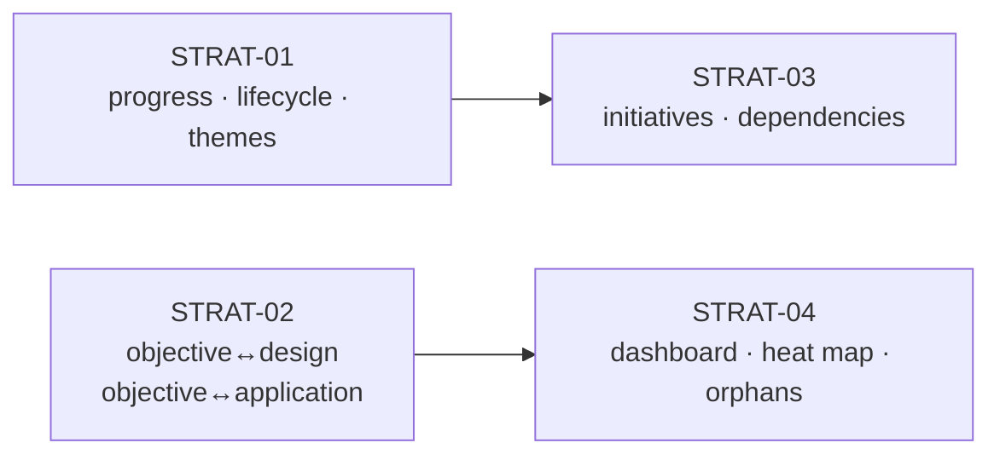

# Strategy Domain (Layer 0) — Expansion Specifications

Four specs, sequenced by dependency. SPEC-STRAT-01 and SPEC-STRAT-02 have no
dependency on each other and can ship in parallel. SPEC-STRAT-03 assumes
SPEC-STRAT-01's lifecycle field exists. SPEC-STRAT-04 assumes SPEC-STRAT-02's
join table exists (for the objective→design rollup) and is otherwise read-only.

| Spec | Title | Package | Depends on |
|---|---|---|---|
| STRAT-01 | Objective progress tracking, lifecycle status, and first-class themes | `adp.strategy` | none |
| STRAT-02 | Reverse traceability: objective↔design and objective↔application links | `adp.strategy` | none |
| STRAT-03 | Strategy execution layer: initiatives and objective dependencies | `adp.strategy` (new submodule) or new sibling package — see §3.2 | STRAT-01 |
| STRAT-04 | Strategy rollups: Overview dashboard card, heat map, orphan report | `adp.strategy` (read-side only) | STRAT-02 |

Each spec below follows the package shape already established across the
codebase (`models.py` / `store.py` / `router.py`), the join-table shape from
`research-solution-architecture.md` §4 (composite PK, `ON DELETE CASCADE` on
both legs, one index on the "other side", plain `created_at`), and the
AI-proposes/human-confirms pattern where an AI-assisted flow is in scope.

---

## SPEC-STRAT-01 — Objective progress tracking, lifecycle status, and first-class themes

### 1. Problem

`strategic_objectives` today carries a target (metric name, target value, unit,
direction) but no actual/observed value over time, and no status beyond
existing-or-deleted. Themes are a taxonomy tag with no independent record.
Neither a human nor a query can currently answer "is this objective on track?"
or "what's this theme's overall health?" without leaving the system.

### 2. Scope

**In scope:**
- A time-series of actual values per objective (`strategic_objective_progress`).
- A derived/computed status enum surfaced on read (not manually set), plus one
  manually-set status for terminal states (`abandoned`).
- Promoting `theme` from a tag column to a first-class entity table
  (`strategic_themes`) with description, owner, and priority.

**Out of scope (deferred to later specs or open frontier):**
- Automatic notifications/alerts on status change.
- Cross-objective rollups (STRAT-04).
- AI-assisted progress extraction — progress entries are human-entered only in
  this spec; if a future spec wants AI-assisted ingestion (e.g. from a linked
  KPI source), it must go through the standard AI-proposes/human-confirms gate.

### 3. Data model

**`strategic_themes`** (new table, replaces the current tag column)
| Column | Type | Notes |
|---|---|---|
| `id` | UUID PK | |
| `name` | TEXT | unique, not null |
| `description` | TEXT | nullable |
| `owner_id` | UUID FK → users | nullable |
| `priority` | SmallInteger | CHECK constraint, ordered scale (1–5), matches convention used for maturity/strategic-relevance scoring |
| `created_at` | TIMESTAMPTZ | |
| `updated_at` | TIMESTAMPTZ | |

`strategic_objectives.theme_id` becomes a proper FK to `strategic_themes.id`
(migration must backfill existing free-text theme tags into rows before
dropping the old column — see §6).

**`strategic_objective_progress`** (new table)
| Column | Type | Notes |
|---|---|---|
| `objective_id` | UUID FK → strategic_objectives, `ON DELETE CASCADE` | part of composite context, indexed |
| `as_of_date` | DATE | |
| `actual_value` | NUMERIC | never floating point, per existing convention |
| `note` | TEXT | nullable, free text entered by the recording architect |
| `recorded_by` | UUID FK → users | not null |
| `created_at` | TIMESTAMPTZ | |

PK: `(objective_id, as_of_date)` — one entry per objective per day, following
the composite-PK join-table shape even though this isn't strictly a many-to-many
link.

**`strategic_objectives.status`** (new column on existing table)
- `Text` with named CHECK constraint (semantic/unordered set, per existing
  convention for fields like objective direction): `proposed`, `active`,
  `at_risk`, `achieved`, `abandoned`.
- `proposed`, `active`, `achieved` are **derived on write** by a store-layer
  function comparing latest `actual_value` against target/direction — not
  directly settable via the API for those three values.
- `at_risk` is also derived: latest progress entry's trend over the last N
  entries (N configurable, default 3) moving away from target.
- `abandoned` is the one manually-set terminal value — requires an explicit
  reason, stored in a new `status_reason` TEXT column.

### 4. API surface (additions to `adp.strategy.router`)

| Method | Path | Action | Notes |
|---|---|---|---|
| `POST` | `/strategy/objectives/{id}/progress` | `strategy:write` | append-only; rejects duplicate `as_of_date` for same objective with 409 |
| `GET` | `/strategy/objectives/{id}/progress` | ungated read | returns full time-series, ordered by `as_of_date` |
| `PATCH` | `/strategy/objectives/{id}/status` | `strategy:write` | only accepts `abandoned` with a `status_reason`; any other value returns 400 with guidance that status is derived |
| `POST` | `/strategy/themes` | `strategy:write` | |
| `GET` / `PATCH` / `DELETE` | `/strategy/themes/{id}` | ungated read / `strategy:write` / `strategy:write` | delete blocked (409) while any objective references the theme, consistent with the existing "deleting an objective cascades its links, never orphans them" rule — themes are the referenced side, so this is a block, not a cascade |

### 5. Permissions

No new `ActionType` values — reuses existing `strategy:write`. Route-prefix
registration follows the existing pattern (one prefix rule for
`/strategy/objectives/*/progress` and one for `/strategy/themes/*`); the
completeness test that asserts every mutating route has a mapped action will
catch a missed registration.

### 6. Migration notes

- New Alembic revision, sequential after the current head.
- Backfill step: for every distinct existing theme string on
  `strategic_objectives`, insert one `strategic_themes` row, then update the
  FK. Must be idempotent and safe to re-run (guard on `name` uniqueness).
- `status` column added with default `proposed`; a data-migration pass computes
  initial derived status for existing objectives with progress data (none yet,
  since this spec introduces progress — so this is effectively a no-op on
  first deploy, but the migration should not assume that).

### 7. UI / screen impact

- `03-strategy.png` (Strategy → Objectives): objective detail view gains a
  progress mini-chart and a status badge; theme dropdown becomes a managed
  list (add/edit themes inline) instead of free text.
- No new screen required.

### 8. Open questions for SDD review

- Is a daily-granularity `as_of_date` PK too coarse if two updates land the
  same day (e.g. correction)? Alternative: surrogate `id` PK + unique index on
  `(objective_id, as_of_date)`, allowing a documented "supersede" pattern.
- Should `at_risk` trend window (N=3) be a platform-admin-configurable value
  (via `adp.admin`) rather than a hardcoded default?

---

## SPEC-STRAT-02 — Reverse traceability: objective↔design and objective↔application links

### 1. Problem

Traceability today is one-directional and stops at Layer 1: an objective links
to capabilities and value streams, but nothing links an objective forward to
the Layer 3 designs or Layer 2 applications that actually realize it. This is
explicitly flagged in the business requirements' "Open frontier" section as the
top-priority gap.

### 2. Scope

**In scope:**
- `objective_design_links` — join table, objective↔design.
- `objective_application_links` — join table, objective↔application.

**Out of scope:**
- Objective↔transformation-initiative links — deferred to STRAT-03, which
  introduces the initiative concept properly rather than linking objectives to
  the existing `application`-scoped initiative model prematurely.
- Any UI beyond surfacing the links on existing detail screens (rollup views
  are STRAT-04).

### 3. Data model

Both tables follow the exact join-table shape from
`research-solution-architecture.md` §4:

**`objective_design_links`**
| Column | Type | Notes |
|---|---|---|
| `objective_id` | UUID FK → strategic_objectives, `ON DELETE CASCADE` | |
| `design_id` | UUID FK → designs, `ON DELETE CASCADE` | indexed (the "other side") |
| `created_at` | TIMESTAMPTZ | |

PK: `(objective_id, design_id)`.

**`objective_application_links`**
| Column | Type | Notes |
|---|---|---|
| `objective_id` | UUID FK → strategic_objectives, `ON DELETE CASCADE` | |
| `application_id` | UUID FK → applications, `ON DELETE CASCADE` | indexed |
| `created_at` | TIMESTAMPTZ | |

PK: `(objective_id, application_id)`.

Per the existing cross-package validation convention: the `strategy` router
validates a `design_id` or `application_id` exists by opening a second,
domain-scoped session and calling `adp.store.get_design` /
`adp.application.store.get_application` directly — no new internal HTTP call,
no duplicated existence check.

### 4. API surface

| Method | Path | Action |
|---|---|---|
| `POST` | `/strategy/objectives/{id}/designs/{design_id}` | `strategy:write` |
| `DELETE` | `/strategy/objectives/{id}/designs/{design_id}` | `strategy:write` |
| `GET` | `/strategy/objectives/{id}/designs` | ungated read |
| `POST` / `DELETE` / `GET` | mirror above for `/applications/{application_id}` | same pattern |
| `GET` | `/store/designs/{id}/objectives` | ungated read — reverse lookup, lives in `adp.store` per existing convention that traceability reads are exposed from both sides |
| `GET` | `/application/{id}/objectives` | ungated read — same reverse-lookup convention |

### 5. Permissions

Reuses `strategy:write` for the forward link-management endpoints. The two new
reverse-lookup GET endpoints are ungated reads, consistent with "reads are
ungated by default" (only sensitivity-marked application data — risk, cost,
governance — carries its own permission, and these endpoints expose neither).

### 6. Migration notes

- Single new Alembic revision adding both join tables — no backfill needed,
  net-new relationship.
- This is the fifth many-to-many traceability link table, matching the count
  already anticipated in `research-solution-architecture.md` §7
  ("about to be used a fifth (objective↔design, filed as a follow-on)") — this
  spec also adds a sixth (objective↔application) in the same migration for
  efficiency, since both are additive and low-risk.

### 7. UI / screen impact

- `09-designs.png` (Designs) and `10-intake.png` gain an "Objectives realized"
  section, matching the existing "linked capabilities/value streams" pattern
  shown in the requirements-intake screen.
- `04-applications.png` gains the same section.
- `03-strategy.png` objective detail view gains "Designs realizing this
  objective" and "Applications realizing this objective" panels.

### 8. Open questions for SDD review

- Should linking an objective to a design require the design to already be
  linked (via capability/value-stream) to that objective's own capability/
  value-stream targets, as a soft consistency check — or is an independent,
  unconstrained link intentional (a design can realize an objective through a
  capability the objective doesn't directly name)?
- Does `DELETE /strategy/objectives/{id}/designs/{design_id}` need an audit
  entry beyond the standard write-audit, given traceability removal is
  higher-stakes than most edits?

---

## SPEC-STRAT-03 — Strategy execution layer: initiatives and objective dependencies

### 1. Problem

An objective currently links straight to capabilities/value streams with no
representation of the actual program of work delivering it, and no way to
express that one objective blocks or depends on another. Transformation
initiatives exist today but live under `adp.application`, scoped to
applications rather than strategy.

### 2. Scope

**In scope:**
- `strategy_initiatives` — a strategy-owned initiative record with status,
  owner, and a link to one or more objectives (many-to-many, since one
  initiative can serve multiple objectives).
- `strategic_objective_dependencies` — self-referential link on objectives
  expressing blocks/depends-on.

**Out of scope:**
- Merging or migrating the existing `adp.application` transformation-initiative
  concept — the two remain distinct (a strategy initiative is the
  strategy-level program; an application transformation initiative is the
  Layer 2 execution artifact). A future spec may propose linking
  `strategy_initiatives` to `application` initiatives once both are stable;
  not attempted here.

### 3.1 Data model

**`strategy_initiatives`**
| Column | Type | Notes |
|---|---|---|
| `id` | UUID PK | |
| `name` | TEXT | not null |
| `description` | TEXT | nullable |
| `owner_id` | UUID FK → users | not null |
| `status` | TEXT | named CHECK constraint: `planned`, `in_progress`, `blocked`, `complete`, `cancelled` — manually set (unlike objective status, this has no derivable signal to compute from) |
| `created_at` / `updated_at` | TIMESTAMPTZ | |

**`strategy_initiative_objective_links`** (join table, standard shape)
| Column | Type | Notes |
|---|---|---|
| `initiative_id` | UUID FK → strategy_initiatives, `ON DELETE CASCADE` | |
| `objective_id` | UUID FK → strategic_objectives, `ON DELETE CASCADE` | indexed |
| `created_at` | TIMESTAMPTZ | |

PK: `(initiative_id, objective_id)`.

**`strategic_objective_dependencies`** (self-referential join table)
| Column | Type | Notes |
|---|---|---|
| `objective_id` | UUID FK → strategic_objectives, `ON DELETE CASCADE` | the dependent objective |
| `depends_on_objective_id` | UUID FK → strategic_objectives, `ON DELETE CASCADE` | indexed |
| `created_at` | TIMESTAMPTZ | |

PK: `(objective_id, depends_on_objective_id)`. Application-layer check (store
function, not DB constraint — cycle detection isn't expressible as a CHECK)
rejects a link that would create a cycle, returning 400.

### 3.2 Package placement — needs an SDD decision

Two options, per the codebase's own stated precedent ("a genuinely new
sub-domain always gets its own sibling package rather than growing an already-
large existing one," measured by line count before deciding):

- **Option A:** New submodule inside `adp.strategy` (`strategy/initiatives.py`
  alongside existing `models.py`/`store.py`/`router.py`) if `adp.strategy`'s
  current line count is well under the ~2,847-line threshold that triggered
  the `adp.business` → `adp.strategy` split.
- **Option B:** New sibling package `adp.strategy_initiatives` if it's closer
  to that threshold, or if initiatives are expected to grow substantially
  (dependency graphs, Gantt-style scheduling, etc. in future specs).

This spec recommends **Option A** at time of writing (Strategy is described as
"the newest, thinnest layer") but the actual line count should be measured
before implementation, per the codebase's own convention.

### 4. API surface

| Method | Path | Action |
|---|---|---|
| `POST` / `GET` / `PATCH` / `DELETE` | `/strategy/initiatives` (+ `/{id}`) | `strategy:write` / ungated read / `strategy:write` / `strategy:write` |
| `POST` / `DELETE` | `/strategy/initiatives/{id}/objectives/{objective_id}` | `strategy:write` |
| `POST` / `DELETE` | `/strategy/objectives/{id}/depends-on/{other_id}` | `strategy:write` — validates no cycle before insert |
| `GET` | `/strategy/objectives/{id}/dependencies` | ungated read — returns both directions (blocks / blocked-by) |

### 5. Permissions

Reuses `strategy:write`. No new `ActionType`.

### 6. Migration notes

- New Alembic revision. Net-new tables, no backfill.
- Cycle-detection logic belongs in `store.py`, not the migration — flag this
  explicitly in code review since it's the one piece of business logic in this
  spec that isn't enforceable at the database level.

### 7. UI / screen impact

- `03-strategy.png` gains an "Initiatives" tab alongside Objectives/Themes.
- Objective detail view gains a "Depends on / Blocks" panel, rendered as a
  small graph or simple bidirectional list (SDD to decide based on expected
  dependency density — likely low given "the newest, thinnest layer").

### 8. Open questions for SDD review

- Resolve §3.2 package placement before implementation begins.
- Should initiative `status` transitions be constrained (e.g. `complete` only
  reachable from `in_progress`), matching the design lifecycle's enforced
  `draft → proposed → current → deprecated → decommissioned` sequence — or
  left as a free enum given initiatives are a lighter-weight concept?

---

## SPEC-STRAT-04 — Strategy rollups: Overview dashboard card, heat map, orphan report

### 1. Problem

The Overview dashboard has no strategy-layer visibility (explicitly flagged in
open frontier), and there is no portfolio-level view connecting objectives to
outcomes across the estate. Once STRAT-01 (progress/status) and STRAT-02
(objective↔design links) exist, these become renderable queries rather than
new data-entry surfaces — consistent with the platform's core thesis that a
report should be "a rendered output of the model, not a separately hand-
maintained artifact."

### 2. Scope

**In scope (read-only, no new write paths, no new tables):**
- A `Strategy` stat tile + domain card on the Overview screen, matching the
  existing four-domain-card pattern.
- A strategy heat map: objectives × status, optionally filterable by theme.
- An orphan report: capabilities and value streams with zero strategic
  linkage (i.e. not referenced by any `strategic_objective` link).

**Out of scope:**
- A full causal/portfolio "strategy map" (Layer 0 → Layer 3 rollup) is
  explicitly named in the business requirements as an open research question
  with no established best-practice pattern yet — this spec delivers the
  simpler heat map and orphan report now, and treats the causal view as a
  separate, later spec once the research question is resolved.

### 3. Data model

None — this spec is read-side only, composed from tables introduced in
STRAT-01 and STRAT-02.

### 4. API surface

| Method | Path | Notes |
|---|---|---|
| `GET` | `/strategy/summary` | returns objective counts by status, theme count, initiative count (if STRAT-03 shipped) — feeds Overview tile |
| `GET` | `/strategy/heatmap` | objectives grouped by status × theme, optional `theme_id` filter |
| `GET` | `/business/orphans` | capabilities/value streams with no `strategic_objective` link — lives in `adp.business` per the existing convention that a domain exposes reads about its own entities, even when the "why" comes from another domain |

All three are ungated reads (aggregate/derived data, no sensitivity
classification applies).

### 5. Permissions

None new — all-read, no `ActionType` additions.

### 6. Migration notes

None — no schema changes.

### 7. UI / screen impact

- `01-overview.png`: new "Strategy" domain card alongside the existing four,
  with a stat tile (e.g. active objectives, at-risk count) — matches the
  existing card format exactly, no new layout pattern introduced.
- `03-strategy.png`: new "Heat Map" tab.
- `02-business.png`: orphan report surfaced as a filter/badge on the
  Capability Map and Value Streams tabs ("no strategic linkage"), rather than
  a new screen.

### 8. Open questions for SDD review

- Orphan report performance at scale: fine for the current demo dataset size,
  but should be checked against a realistic capability count (three-level
  hierarchy) before assuming a simple `NOT IN` / `LEFT JOIN ... IS NULL` query
  is sufficient without an index-backed materialized view.
- Should `/strategy/summary` cache its aggregate (short TTL) given it's
  designed to back a dashboard tile that will be requested on every Overview
  page load?

---

## Cross-spec sequencing summary

STRAT-01 and STRAT-02 can be built and reviewed in parallel; STRAT-03 depends
on STRAT-01's `status` field; STRAT-04 depends on STRAT-02's join tables (and
optionally STRAT-03's initiative count, if sequenced after).
